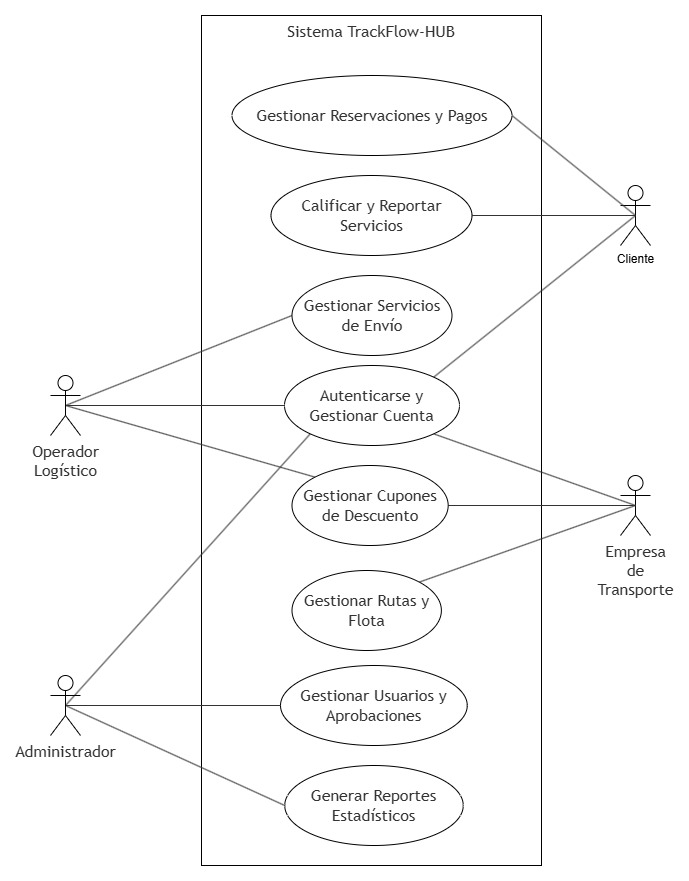
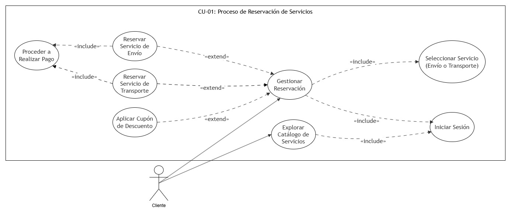
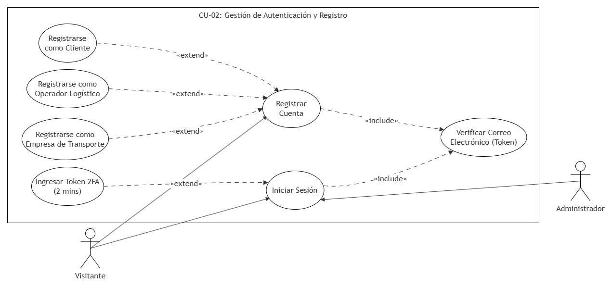
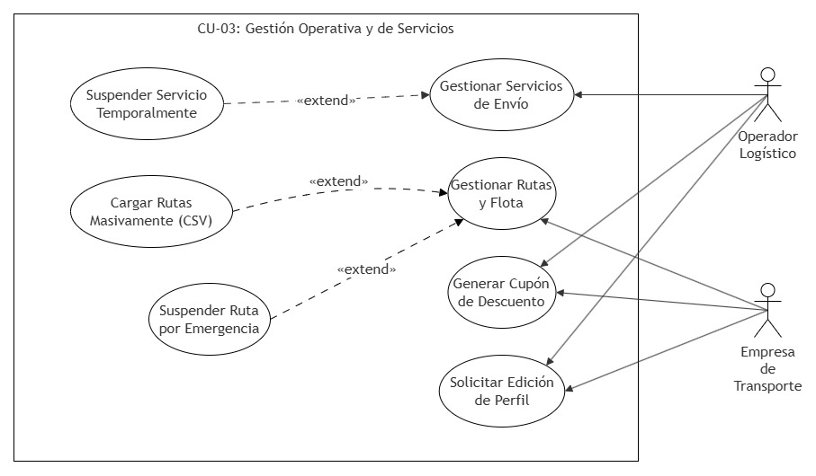
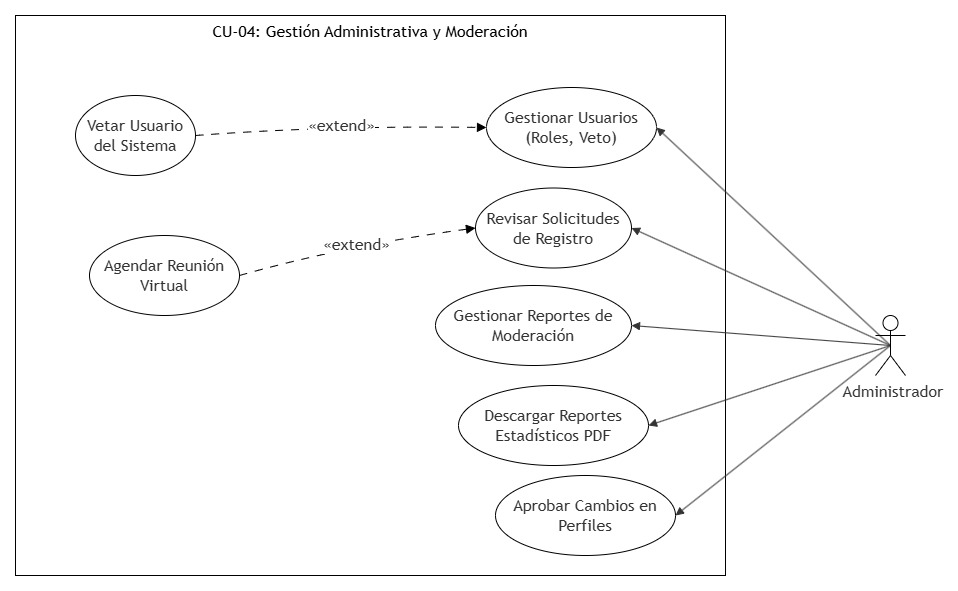

# Casos de Uso

## CU-General: Sistema TrackFlow-HUB

## CU-01: Proceso de Reservación de Servicios

## CU-02: Gestión de Autenticación y Registro

## CU-03: Gestión Operativa y de Servicios

## CU-04: Gestión Administrativa y Moderación

