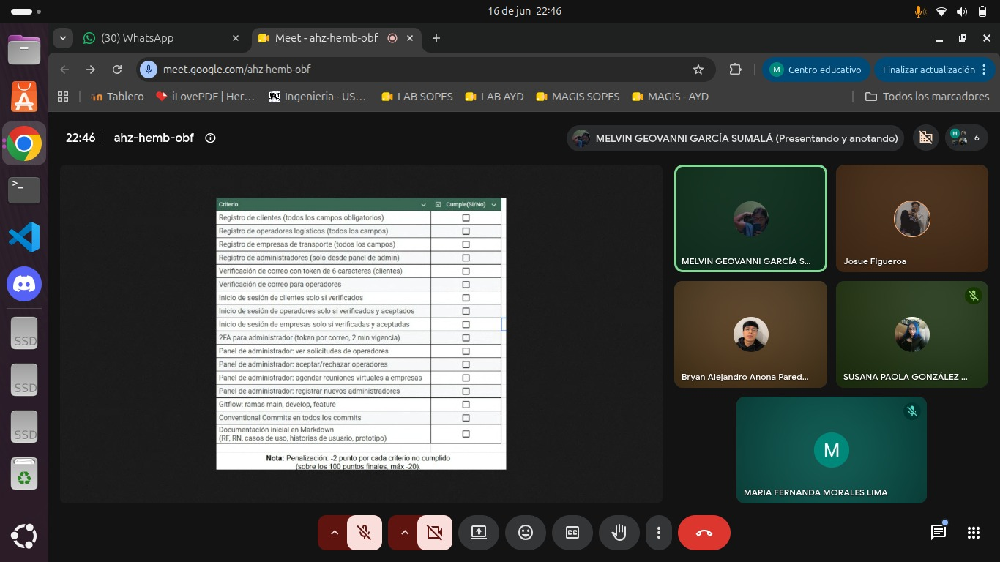

# Sprint Planning 1

Se organizo para avanzar en la autenticación, el módulo de administración, el envío de correos, la documentación y la base de datos. Cada integrante iniciará con una parte concreta del sistema para mantener el trabajo ordenado y evitar bloqueos entre áreas.

### Integrante 1: Maria Fernanda Morales Lima - 202300378
Se enfocará en el login y la autenticación por roles, incluyendo la redirección a los dashboards y la verificación en dos pasos para el administrador.

### Integrante 2: Josue David Figueroa Acosta - 202307378
Comenzará con el módulo de administración, trabajando en la revisión de solicitudes y en las vistas necesarias para gestionar operadores y empresas.

### Integrante 3: Bryan Alejandro Anona Paredes - 202307272
Iniciará con el sistema de correos, preparando las APIs y el envío de notificaciones para la verificación y el 2FA del administrador.

### Integrante 4: Susana Paola González Contreras - 202000576
Trabajará primero en la documentación del proyecto y en los prototipos de interfaces para dejar claras las pantallas y el flujo general.

### Integrante 5: Melvin Geovanni García Sumalá - 202300712
Empezará con la estructura de la base de datos y los registros de usuario, asegurando que cada tipo de cuenta tenga sus campos correctos.

---

# Daily Scrum — Sprint 1 — Día 1

Fecha: 13 Junio 2026

### Integrante 1: Maria Fernanda Morales Lima - 202300378
| Pregunta | Respuesta |
| --- | --- |
| **¿Qué hice ayer?** | Revisé el código base que ya tenían avanzado mis compañeros para entender la estructura y adaptar mi parte sin romper nada. |
| **¿Qué haré hoy?** | Intentaré levantar el proyecto (frontend, backend y base de datos) para empezar a trabajar en el login. |
| **¿Impedimentos?** | Es la primera vez que trabajo con Docker en equipo y estoy teniendo muchos problemas de configuración con el archivo `.env`. |

### Integrante 2: Josue David Figueroa Acosta - 202307378
| Pregunta | Respuesta |
| --- | --- |
| **¿Qué hice ayer?** | Revisé los requerimientos del módulo de administrador para entender el flujo de aprobación de operadores y empresas. |
| **¿Qué haré hoy?** | Empezaré a codificar las vistas para ver, aceptar y rechazar solicitudes en el dashboard. |
| **¿Impedimentos?** | Estamos teniendo problemas de compatibilidad con versiones de Windows y Linux al momento de ejecutar el script `.sh` de la base de datos. |

### Integrante 3: Bryan Alejandro Anona Paredes - 202307272
| Pregunta | Respuesta |
| --- | --- |
| **¿Qué hice ayer?** | Investigué y preparé el entorno de Node.js instalando la librería Nodemailer para el servicio de correos. |
| **¿Qué haré hoy?** | Empezaré a crear las APIs desde el backend y a preparar las plantillas HTML para la verificación de correos. |
| **¿Impedimentos?** | Ninguno por el momento. |

### Integrante 4: Susana Paola González Contreras - 202000576
| Pregunta | Respuesta |
| --- | --- |
| **¿Qué hice ayer?** | Logré organizar la estructura del documento y avanzar con los Requerimientos Funcionales y No Funcionales. |
| **¿Qué haré hoy?** | Comenzaré a redactar las Historias de Usuario y armar los Diagramas de Casos de Uso. |
| **¿Impedimentos?** | Ninguno por el momento. |

### Integrante 5: Melvin Geovanni García Sumalá - 202300712
| Pregunta | Respuesta |
| --- | --- |
| **¿Qué hice ayer?** | Organicé el tablero Kanban creando las columnas y las tarjetas necesarias para que todos podamos dar seguimiento al sprint. |
| **¿Qué haré hoy?** | Trabajaré en la creación de toda la estructura de la base de datos. |
| **¿Impedimentos?** | Ninguno por el momento. |

---

# Daily Scrum — Sprint 1 — Día 2

Fecha: 15 Junio 2026

### Integrante 1: Maria Fernanda Morales Lima - 202300378
| Pregunta | Respuesta |
| --- | --- |
| **¿Qué hice ayer?** | Logré resolver los problemas del Docker y empecé a programar el login, pero perdí tiempo con las rutas hacia los dashboards y con unos hashes de contraseñas que se guardaban mal por caracteres especiales. |
| **¿Qué haré hoy?** | Dejaré funcionando el login básico para clientes, operadores y empresas. |
| **¿Impedimentos?** | Me sigue costando un poco el entorno de desarrollo, necesito comunicarme más rápido con el equipo cuando me trabo. |

### Integrante 2: Josue David Figueroa Acosta - 202307378
| Pregunta | Respuesta |
| --- | --- |
| **¿Qué hice ayer?** | Terminé la función de revisar y aceptar/rechazar solicitudes y empecé con el agendamiento de reuniones virtuales. |
| **¿Qué haré hoy?** | Terminaré el login de empresas que depende de la reunión y el registro de nuevos administradores. |
| **¿Impedimentos?** | Tuvimos interrupciones en las pruebas porque las credenciales del admin en la base de datos estaban incorrectas. |

### Integrante 3: Bryan Alejandro Anona Paredes - 202307272
| Pregunta | Respuesta |
| --- | --- |
| **¿Qué hice ayer?** | Logré optimizar el tiempo de envío de correos y conecté fácilmente el frontend con las APIs del backend. |
| **¿Qué haré hoy?** | Implementaré el envío del token de 6 dígitos para el 2FA del administrador. |
| **¿Impedimentos?** | Ayer no levanté bien la DB y creé un usuario y contraseña de admin incorrectos, lo que interrumpió las pruebas del equipo. Lo arreglaré hoy. |

### Integrante 4: Susana Paola González Contreras - 202000576
| Pregunta | Respuesta |
| --- | --- |
| **¿Qué hice ayer?** | Logré terminar todas las Historias de Usuario y los Casos de Uso en formato Markdown. |
| **¿Qué haré hoy?** | Empezaré con el Prototipo de interfaces. |
| **¿Impedimentos?** | Me está costando bastante esta parte porque no tengo conocimiento previo sobre cómo hacer prototipos ni qué herramienta utilizar. Estoy perdiendo tiempo investigando esto desde cero. |

### Integrante 5: Melvin Geovanni García Sumalá - 202300712
| Pregunta | Respuesta |
| --- | --- |
| **¿Qué hice ayer?** | Terminé de levantar la base de datos completa y comencé con el endpoint de registro de clientes. |
| **¿Qué haré hoy?** | Terminaré el registro para operadores y para empresas, validando que pidan campos distintos. |
| **¿Impedimentos?** | Me di cuenta de que algunas tarjetas que creé en el Kanban no fueron lo bastante específicas y generaron algo de confusión en el equipo sobre los alcances. |

---

# Daily Scrum — Sprint 1 — Día 3

Fecha: 16 Junio 2026

### Integrante 1: Maria Fernanda Morales Lima - 202300378
| Pregunta | Respuesta |
| --- | --- |
| **¿Qué hice ayer?** | Terminé por completo el login y la redirección por roles, sin romper el código que ya existía. |
| **¿Qué haré hoy?** | Implementaré la verificación en dos pasos (2FA) para el administrador y coordinaré las credenciales finales con todos para las pruebas. |
| **¿Impedimentos?** | Ninguno, ya superé los problemas iniciales de configuración. |

### Integrante 2: Josue David Figueroa Acosta - 202307378
| Pregunta | Respuesta |
| --- | --- |
| **¿Qué hice ayer?** | Terminé todas las tareas del módulo de administrador logrando finalizar en un tiempo menor al acordado. |
| **¿Qué haré hoy?** | Apoyaré en las pruebas finales del sistema y la revisión del flujo completo. |
| **¿Impedimentos?** | Ninguno, la buena distribución del trabajo nos ayudó bastante. |

### Integrante 3: Bryan Alejandro Anona Paredes - 202307272
| Pregunta | Respuesta |
| --- | --- |
| **¿Qué hice ayer?** | Corregí el problema de la base de datos y dejé funcionando el envío del token 2FA del admin. |
| **¿Qué haré hoy?** | Documentaré mis APIs y me comunicaré con el equipo para que no tengan dudas de cómo funcionan si no estoy disponible. |
| **¿Impedimentos?** | Ninguno, correos finalizados. |

### Integrante 4: Susana Paola González Contreras - 202000576
| Pregunta | Respuesta |
| --- | --- |
| **¿Qué hice ayer?** | Logré terminar los Prototipos de Interfaces. |
| **¿Qué haré hoy?** | Consolidaré la Documentación Inicial completa para entregarla a tiempo. |
| **¿Impedimentos?** | Ninguno, logré terminar a pesar del contratiempo investigando sobre prototipado. |

### Integrante 5: Melvin Geovanni García Sumalá - 202300712
| Pregunta | Respuesta |
| --- | --- |
| **¿Qué hice ayer?** | Finalicé la lógica de registro para todos los tipos de usuarios con sus respectivos campos obligatorios. |
| **¿Qué haré hoy?** | Revisaré que el tablero Kanban esté actualizado y apoyaré en resolver cualquier duda final sobre el enunciado. |
| **¿Impedimentos?** | Ninguno por el momento. |

---

# Dailys Retrospective

## Maria Fernanda Morales Lima
**Carnet:** 202300378
**Responsabilidad:** Login y autenticación por roles

| Aspecto | Resumen |
| --- | --- |
| Qué hice bien | Entendí la base del proyecto, me adapté al código existente e implementé el login para los cuatro roles con verificación en dos pasos para el admin. |
| Qué hice mal | Perdí tiempo por la configuración del entorno, Docker, el archivo `.env`, las rutas y algunos errores con hashes de contraseña. |
| Qué mejorar | Revisar mejor el entorno antes de empezar y comunicar antes cualquier bloqueo con el equipo. |

## Bryan Alejandro Anona Paredes
**Carnet:** 202307272
**Responsabilidad:** Módulo de correos

| Aspecto | Resumen |
| --- | --- |
| Qué hice bien | Implementé el envío de correos con Nodemailer y lo conecté de forma rápida con el frontend y las APIs del backend. |
| Qué hice mal | La base de datos quedó con credenciales de admin incorrectas, lo que interrumpió varias pruebas. |
| Qué mejorar | Compartir mejor el funcionamiento de mis APIs para que el equipo pueda trabajar sin depender de mi disponibilidad. |

## Josue David Figueroa Acosta
**Carnet:** 202307378
**Responsabilidad:** Módulo de administración

| Aspecto | Resumen |
| --- | --- |
| Qué hice bien | Distribuimos bien el trabajo y el proyecto avanzó rápido porque entendimos lo necesario en poco tiempo. |
| Qué hice mal | Hubo problemas de compatibilidad entre Windows y Linux con el script `.sh` de la base de datos. |
| Qué mejorar | Mantener mejor comunicación y seguir puliendo la forma de desarrollar el proyecto. |

## Susana Paola González Contreras
**Carnet:** 202000576
**Responsabilidad:** Documentación y prototipos de interfaces

| Aspecto | Resumen |
| --- | --- |
| Qué hice bien | Entregué a tiempo la documentación y los prototipos solicitados para el sprint. |
| Qué hice mal | Me tomó tiempo aprender a hacer los prototipos y elegir la herramienta adecuada. |
| Qué mejorar | Definir herramientas antes de iniciar y estimar mejor los tiempos en el tablero Kanban. |

## Melvin Geovanni García Sumalá
**Carnet:** 202300712
**Responsabilidad:** Base de datos y registro de usuarios

| Aspecto | Resumen |
| --- | --- |
| Qué hice bien | Organicé el tablero Kanban con las columnas y tarjetas necesarias para dar seguimiento al sprint. |
| Qué hice mal | Algunas tarjetas no fueron lo bastante específicas y eso generó confusión sobre el alcance. |
| Qué mejorar | Resolver dudas sobre el enunciado al inicio del sprint para evitar reinterpretaciones durante la implementación. |

---
---
---
# Sprint Planning 2

Se organizo el trabajo del segundo sprint enfocado en los modulos de operador logistico, empresa de transporte, reportes y pruebas. Cada integrante tomara responsabilidad sobre una parte concreta del sistema para avanzar en paralelo y entregar todas las funcionalidades a tiempo.

### Integrante 1: Maria Fernanda Morales Lima - 202300378
Se encargara del modulo de empresa de transporte, incluyendo la gestion de cupones, solicitudes de cambio de perfil, reportes de empresa y la carga de flota/rutas por CSV.

### Integrante 2: Josue David Figueroa Acosta - 202307378
Trabajara en el modulo de operador logistico, implementando la vista de calificaciones con respuesta a comentarios, el calendario de envios programados y la generacion de cupones.

### Integrante 3: Bryan Alejandro Anona Paredes - 202307272
Implementara las funcionalidades de rutas para la empresa de transporte, incluyendo registro manual, edicion individual, cancelacion/suspension, carga masiva por CSV y la reactivacion de rutas.

### Integrante 4: Susana Paola Gonzalez Contreras - 202000576
Se encargara de los reportes del operador, incluyendo el reporte de ganancias en PDF, historial de clientes y calificaciones/comentarios recibidos.

### Integrante 5: Melvin Geovanni Garcia Sumala - 202300712
Trabajara en el modulo de operador logistico desde el backend y frontend, cubriendo el registro, edicion, eliminacion y suspension de servicios, ademas de la actualizacion de perfil.

---

# Daily Scrum — Sprint 2 — Dia 1

Fecha: 19 Junio 2026

### Integrante 1: Maria Fernanda Morales Lima - 202300378
| Pregunta | Respuesta |
| --- | --- |
| **Que hice ayer?** | Corregi el sistema de autenticacion JWT en el login para que los tokens se reemplacen correctamente al iniciar sesion en diferentes cuentas. |
| **Que hare hoy?** | Implementare la gestion de cupones y el perfil con solicitudes de cambio para el modulo de empresa. |
| **Impedimentos?** | Tuve que resolver primero un conflicto con la rama develop antes de poder subir mis cambios del JWT. |

### Integrante 2: Josue David Figueroa Acosta - 202307378
| Pregunta | Respuesta |
| --- | --- |
| **Que hice ayer?** | Revise los requerimientos del modulo de operador para planificar las vistas de calificaciones y calendario. |
| **Que hare hoy?** | Comenzare con la implementacion de la visualizacion de calificaciones y la funcionalidad de responder comentarios. |
| **Impedimentos?** | Ninguno por el momento, ya tengo claro el alcance de mis tareas. |

### Integrante 3: Bryan Alejandro Anona Paredes - 202307272
| Pregunta | Respuesta |
| --- | --- |
| **Que hice ayer?** | Implemente las APIs de registro manual de rutas, edicion individual y cancelacion/suspension de rutas para la empresa de transporte. |
| **Que hare hoy?** | Terminare la API de carga masiva CSV, el endpoint para obtener rutas y la correccion de seguridad JWT en las rutas. |
| **Impedimentos?** | Tuve que corregir un problema de seguridad porque las rutas de la API no estaban validando el token JWT correctamente. |

### Integrante 4: Susana Paola Gonzalez Contreras - 202000576
| Pregunta | Respuesta |
| --- | --- |
| **Que hice ayer?** | Revise la estructura actual del dashboard de operador para entender donde integrar los reportes que me corresponden. |
| **Que hare hoy?** | Comenzare con el reporte de ganancias en PDF para el operador logistico. |
| **Impedimentos?** | Es la primera vez que trabajo con generacion de PDFs en el backend y estoy investigando la libreria adecuada. |

### Integrante 5: Melvin Geovanni Garcia Sumala - 202300712
| Pregunta | Respuesta |
| --- | --- |
| **Que hice ayer?** | Levante el frontend del modulo de operador y deje funcionando el registro de servicios con zona, capacidad, precio y fotos. |
| **Que hare hoy?** | Implementare la edicion y eliminacion de servicios del operador para completar el CRUD basico. |
| **Impedimentos?** | Tuve problemas de merge con develop porque Bryan y Maria tambien estaban subiendo cambios al mismo tiempo. |

---

# Daily Scrum — Sprint 2 — Dia 2

Fecha: 20 Junio 2026

### Integrante 1: Maria Fernanda Morales Lima - 202300378
| Pregunta | Respuesta |
| --- | --- |
| **Que hice ayer?** | Termine la gestion de cupones para empresa, las solicitudes de cambio de perfil y el envio de cupones por correo a los clientes. |
| **Que hare hoy?** | Implementare los reportes del modulo empresa, la flota de vehiculos con CSV y el resumen del dashboard de empresa. |
| **Impedimentos?** | Tuve que corregir un query de estado de rutas que no filtraba correctamente los datos para los reportes. |

### Integrante 2: Josue David Figueroa Acosta - 202307378
| Pregunta | Respuesta |
| --- | --- |
| **Que hice ayer?** | Avance con la logica de calificaciones del operador, preparando los endpoints y la conexion con el frontend. |
| **Que hare hoy?** | Terminare la visualizacion de calificaciones con la opcion de responder comentarios y comenzare la vista de calendario. |
| **Impedimentos?** | Ninguno, las APIs del backend estan respondiendo correctamente. |

### Integrante 3: Bryan Alejandro Anona Paredes - 202307272
| Pregunta | Respuesta |
| --- | --- |
| **Que hice ayer?** | Termine la carga masiva CSV, el frontend de rutas para empresa y la correccion de seguridad JWT en todas las APIs de rutas. |
| **Que hare hoy?** | Implementare la reactivacion de rutas y el envio de correos de aprobacion/rechazo para los cambios de perfil. |
| **Impedimentos?** | Ninguno, el modulo de rutas esta casi completo. |

### Integrante 4: Susana Paola Gonzalez Contreras - 202000576
| Pregunta | Respuesta |
| --- | --- |
| **Que hice ayer?** | Avance con la investigacion de la libreria para PDFs y empece a estructurar el reporte de ganancias. |
| **Que hare hoy?** | Continuare con la implementacion del reporte de ganancias en PDF y comenzare el reporte de historial de clientes. |
| **Impedimentos?** | Me costo conectar la generacion del PDF con los datos reales de la base de datos, pero ya lo resolvi. |

### Integrante 5: Melvin Geovanni Garcia Sumala - 202300712
| Pregunta | Respuesta |
| --- | --- |
| **Que hice ayer?** | Termine la edicion y eliminacion de servicios del operador logistico. |
| **Que hare hoy?** | Implementare la suspension y activacion temporal de servicios y la funcionalidad de actualizar perfil del operador. |
| **Impedimentos?** | Tuve que resolver un merge con develop antes de poder subir mis cambios, lo que me atraso un poco. |

---

# Daily Scrum — Sprint 2 — Dia 3

Fecha: 22 Junio 2026

### Integrante 1: Maria Fernanda Morales Lima - 202300378
| Pregunta | Respuesta |
| --- | --- |
| **Que hice ayer?** | Termine todos los reportes del modulo empresa, la flota con CSV y el resumen del dashboard. El modulo de empresa esta completo. |
| **Que hare hoy?** | Preparare las pruebas unitarias y E2E del modulo de empresa para la entrega. |
| **Impedimentos?** | Ninguno, todo el modulo esta funcionando correctamente. |

### Integrante 2: Josue David Figueroa Acosta - 202307378
| Pregunta | Respuesta |
| --- | --- |
| **Que hice ayer?** | Termine la vista de calificaciones con respuesta a comentarios, el calendario de envios y la generacion de cupones del operador. |
| **Que hare hoy?** | Revisare el flujo completo del operador y preparare las pruebas unitarias y E2E correspondientes. |
| **Impedimentos?** | Ninguno, logre terminar todas mis tareas del modulo de operador. |

### Integrante 3: Bryan Alejandro Anona Paredes - 202307272
| Pregunta | Respuesta |
| --- | --- |
| **Que hice ayer?** | Termine la reactivacion de rutas y el sistema de correos para aprobacion y rechazo de cambios de perfil. |
| **Que hare hoy?** | Revisare que todas las funcionalidades de rutas esten integradas correctamente y preparare mis pruebas. |
| **Impedimentos?** | Ninguno, el modulo de rutas de empresa esta completo. |

### Integrante 4: Susana Paola Gonzalez Contreras - 202000576
| Pregunta | Respuesta |
| --- | --- |
| **Que hice ayer?** | Termine el reporte de ganancias en PDF, el historial de clientes y el reporte de calificaciones y comentarios recibidos. |
| **Que hare hoy?** | Preparare las pruebas unitarias y E2E de mis reportes para la entrega del sprint. |
| **Impedimentos?** | Ninguno, los tres reportes estan funcionando y generando los PDFs correctamente. |

### Integrante 5: Melvin Geovanni Garcia Sumala - 202300712
| Pregunta | Respuesta |
| --- | --- |
| **Que hice ayer?** | Corregi detalles en la creacion de cupones y en la generacion de reportes en PDF que tenian problemas menores. |
| **Que hare hoy?** | Terminare las correcciones pendientes y preparare las pruebas unitarias y E2E del modulo de operador. |
| **Impedimentos?** | Encontre bugs en los cupones y los reportes PDF que me tomaron tiempo extra resolver, pero ya estan corregidos. |

---

# Sprint Retrospective 2

## Maria Fernanda Morales Lima
**Carnet:** 202300378
**Responsabilidad:** Modulo de empresa de transporte

| Aspecto | Resumen |
| --- | --- |
| Que hice bien | Implemente todo el modulo de empresa incluyendo cupones, solicitudes de perfil, reportes, flota CSV y el dashboard, logrando entregar antes de la fecha limite. |
| Que hice mal | Perdi tiempo corrigiendo un query de estado de rutas que no filtraba bien y un conflicto con el JWT que debio resolverse antes. |
| Que mejorar | Validar los queries con datos reales desde el inicio y coordinar mejor los cambios en archivos compartidos como el login. |

## Bryan Alejandro Anona Paredes
**Carnet:** 202307272
**Responsabilidad:** Rutas de empresa de transporte y correos

| Aspecto | Resumen |
| --- | --- |
| Que hice bien | Termine todas las APIs de rutas incluyendo registro manual, edicion, cancelacion, CSV, reactivacion y el frontend de empresa. |
| Que hice mal | Las APIs de rutas no validaban el JWT correctamente al inicio, lo que genero un problema de seguridad que tuve que corregir. |
| Que mejorar | Implementar la seguridad JWT desde el primer endpoint para no tener que regresar a corregir todas las rutas despues. |

## Josue David Figueroa Acosta
**Carnet:** 202307378
**Responsabilidad:** Modulo de operador logistico

| Aspecto | Resumen |
| --- | --- |
| Que hice bien | Implemente las calificaciones con respuesta a comentarios, el calendario de envios y los cupones del operador sin contratiempos. |
| Que hice mal | Empece un poco tarde mis tareas comparado con el resto del equipo porque estuve revisando requerimientos mas tiempo del necesario. |
| Que mejorar | Comenzar a codificar mas rapido una vez tenga claros los requerimientos y no sobreanalizar el alcance. |

## Susana Paola Gonzalez Contreras
**Carnet:** 202000576
**Responsabilidad:** Reportes del operador logistico

| Aspecto | Resumen |
| --- | --- |
| Que hice bien | Entregue los tres reportes del operador funcionando con generacion de PDF, ganancias, historial de clientes y calificaciones. |
| Que hice mal | Me costo la generacion de PDFs porque no tenia experiencia previa y la conexion con datos reales de la base de datos. |
| Que mejorar | Investigar las herramientas tecnicas antes de que inicie el sprint para no perder tiempo durante la implementacion. |

## Melvin Geovanni Garcia Sumala
**Carnet:** 202300712
**Responsabilidad:** Modulo de operador y coordinacion general

| Aspecto | Resumen |
| --- | --- |
| Que hice bien | Implemente el CRUD completo de servicios del operador, la actualizacion de perfil y apoye en la correccion de cupones y reportes PDF. |
| Que hice mal | Los merges con develop me generaron conflictos frecuentes porque varios integrantes trabajabamos en ramas paralelas al mismo tiempo. |
| Que mejorar | Hacer pulls de develop con mas frecuencia para reducir la cantidad de conflictos al momento de hacer merge. |

