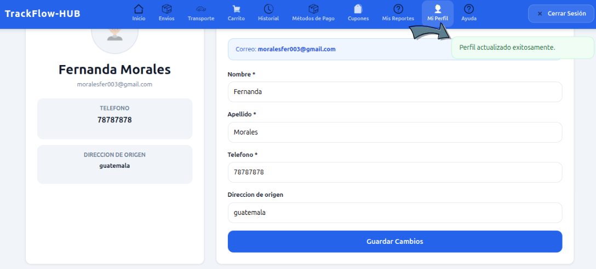
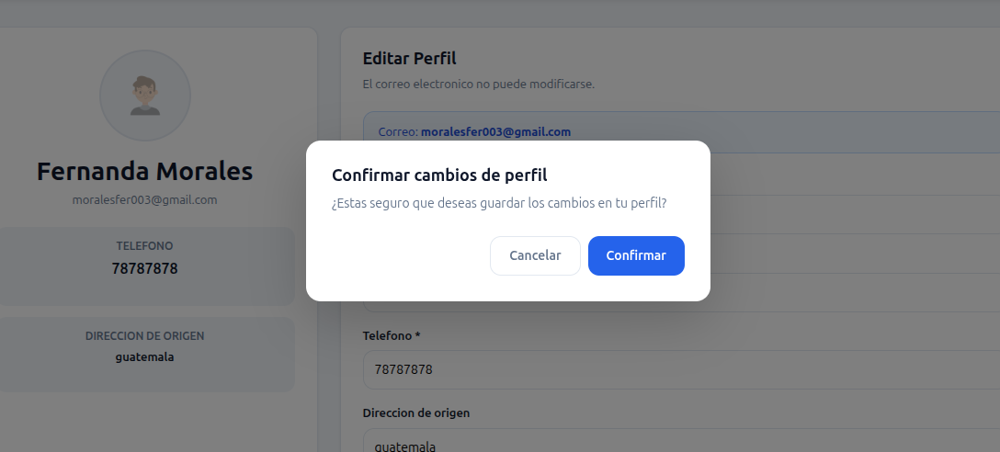
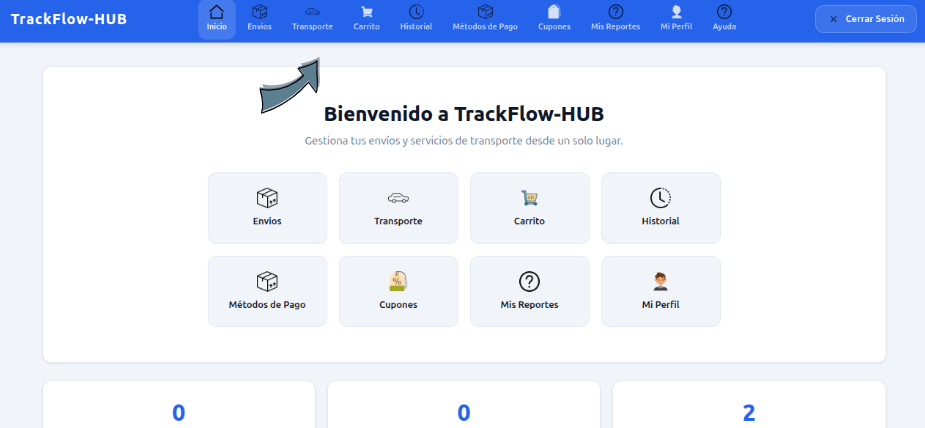
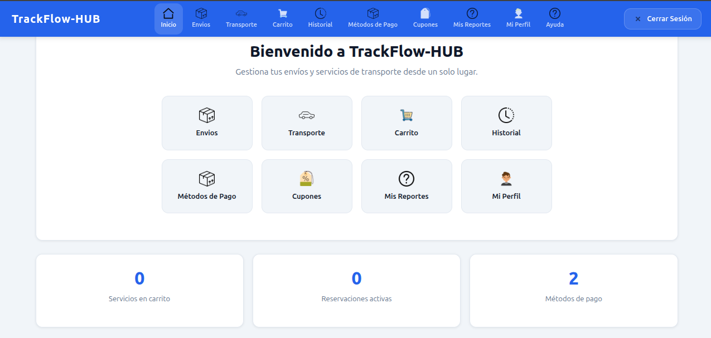
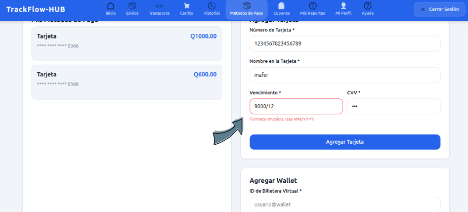
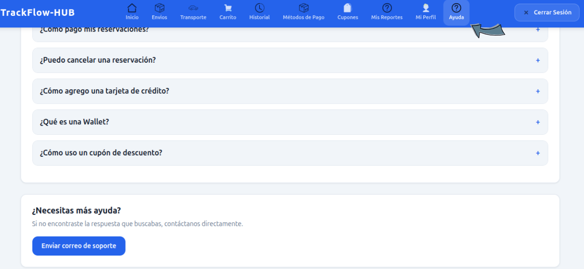
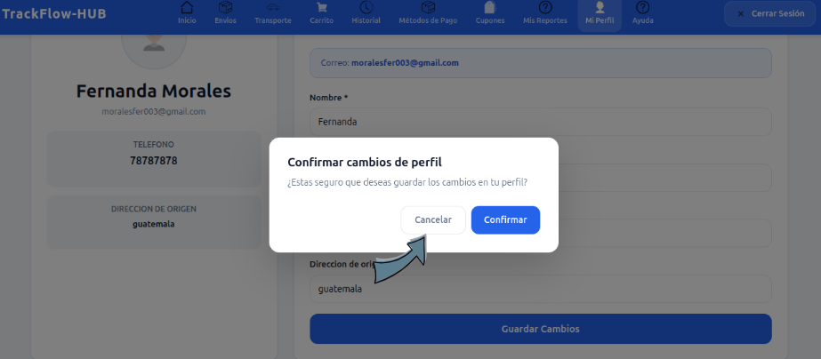
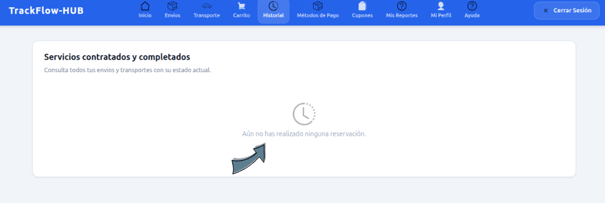

# Principios Heurísticos de Jakob Nielsen

# Introducción

Los principios heurísticos de Jakob Nielsen son un conjunto de reglas generales de usabilidad que sirven como guía para evaluar y mejorar el diseño de interfaces de usuario. En el desarrollo del módulo cliente de TrackFlow-HUB se aplicaron al menos 6 de estos principios de manera concreta y verificable, con el objetivo de garantizar una experiencia de usuario intuitiva, eficiente y libre de errores.

A continuación se documenta cada principio aplicado, con su descripción, la forma en que fue implementado en el sistema y una evidencia visual de su aplicación.

---

# Principio 1: Visibilidad del Estado del Sistema

**Descripción del principio:** El sistema siempre debe mantener informados a los usuarios sobre lo que está ocurriendo, a través de retroalimentación apropiada en un tiempo razonable.

**Aplicación en TrackFlow-HUB:**

Este principio se implementó de dos formas principales dentro del módulo cliente:

**Indicador de carga (Spinner):** Cada vez que el sistema está procesando una solicitud, como agregar un servicio al carrito, procesar un pago o cancelar una reservación, se muestra un spinner de carga en el centro de la pantalla. Durante este tiempo, todos los botones se deshabilitan automáticamente para evitar acciones duplicadas. El usuario sabe en todo momento que el sistema está trabajando en su solicitud.

**Badges de estado en reservaciones:** En la sección de Historial, cada reservación muestra un badge de color indicando su estado actual. Los colores utilizados son: verde para confirmado, azul para en tránsito, verde claro para entregado, rojo para cancelado y amarillo para pendiente. Esto permite al usuario identificar visualmente el estado de cada servicio de un solo vistazo.

  

  <b>Figura 1.</b> Spinner de carga y badges de estado aplicando el principio de Visibilidad del Estado del Sistema.

---

# Principio 2: Prevención de Errores

**Descripción del principio:** Mejor que buenos mensajes de error es un diseño cuidadoso que prevenga que ocurran problemas en primer lugar. Se deben eliminar las condiciones propensas a errores o verificar con el usuario antes de que realice una acción.

**Aplicación en TrackFlow-HUB:**

Este principio se aplicó en múltiples puntos críticos del módulo cliente:

**Modales de confirmación:** Antes de ejecutar cualquier acción irreversible, como eliminar un servicio del carrito, vaciar el carrito completo, confirmar un pago o cancelar una reservación, el sistema muestra un modal de confirmación. Este modal solicita al usuario que confirme explícitamente la acción antes de proceder, evitando que acciones accidentales tengan consecuencias no deseadas. El modal siempre incluye un botón de Cancelar para dar al usuario la opción de retractarse.

**Validación de fecha mínima:** En la sección de Transporte, el campo de fecha de viaje tiene configurada una fecha mínima de 24 horas a partir del día actual. Esto previene que el usuario seleccione fechas inválidas o que no cumplan con la política de reservación del sistema.

**Validación del algoritmo de Luhn:** Al agregar una tarjeta de pago, el sistema valida el número de tarjeta usando el algoritmo de Luhn antes de enviar la solicitud al servidor. Si el número no es válido, el sistema muestra un mensaje de error inmediato debajo del campo, evitando que se registren tarjetas con números incorrectos.

  

  <b>Figura 2.</b> Modal de confirmación aplicando el principio de Prevención de Errores.

---

# Principio 3: Reconocimiento antes que Memorización

**Descripción del principio:** Se debe minimizar la carga de memoria del usuario haciendo que los objetos, acciones y opciones sean visibles. El usuario no debería tener que recordar información de una parte de la interfaz a otra. Las instrucciones para el uso del sistema deben ser visibles o fácilmente recuperables cuando sea necesario.

**Aplicación en TrackFlow-HUB:**

**Navbar con íconos y texto descriptivo:** La barra de navegación superior del módulo cliente combina íconos visuales con etiquetas de texto descriptivo para cada sección. El usuario no necesita memorizar qué hace cada botón, ya que el ícono y el texto juntos comunican claramente la función de cada sección. Los íconos utilizados son imágenes PNG descargadas que representan visualmente el concepto de cada módulo: una casa para Inicio, un autobús para Transporte, un carrito para el Carrito de compras, un reloj para el Historial, y así sucesivamente.

**Accesos directos en el Inicio:** La pantalla de Inicio del dashboard muestra un grid con accesos directos a todas las secciones, cada uno con su ícono y nombre. El usuario puede navegar a cualquier sección desde el inicio sin necesidad de recordar dónde está cada funcionalidad.

**Estados vacíos descriptivos:** Cuando una sección no tiene datos, como el carrito vacío o la sección de cupones sin cupones disponibles, el sistema muestra un mensaje descriptivo con un ícono representativo, indicando claramente qué hace esa sección y cómo puede el usuario comenzar a utilizarla.

  

  <b>Figura 3.</b> Navbar con íconos y texto descriptivo aplicando el principio de Reconocimiento antes que Memorización.

---

# Principio 4: Consistencia y Estándares

**Descripción del principio:** Los usuarios no deben tener que preguntarse si diferentes palabras, situaciones o acciones significan lo mismo. Se deben seguir las convenciones de la plataforma.

**Aplicación en TrackFlow-HUB:**

**Paleta de colores coherente:** Todo el módulo cliente utiliza la misma paleta de colores definida en las variables CSS del proyecto. El color primario `#2563EB` (azul) se usa consistentemente para botones de acción principal, precios destacados y elementos activos. El color secundario `#0F172A` (azul oscuro) se usa para títulos y texto importante. El color de fondo `#F1F5F9` (gris claro) se mantiene en todas las secciones. Esta consistencia permite al usuario predecir el comportamiento visual del sistema.

**Estilos de botones uniformes:** Los botones de acción principal siempre tienen el mismo estilo (fondo azul, texto blanco, bordes redondeados). Los botones secundarios o de cancelar siempre tienen fondo transparente con borde gris. Los botones de acciones peligrosas (eliminar, cancelar reservación) siempre tienen color rojo. Esta uniformidad comunica visualmente el nivel de importancia de cada acción.

**Estructura de tarjetas consistente:** Todas las tarjetas del sistema (rutas, cupones, reservaciones, métodos de pago, vehículos) siguen la misma estructura visual: fondo blanco, borde gris claro, border-radius de 12px y sombra suave. Esto crea una experiencia visual coherente en todo el módulo.

**Radio de bordes uniforme:** Se utiliza la variable CSS `--radio: 12px` en todos los elementos redondeados del sistema, garantizando que todos los bordes tengan el mismo nivel de curvatura.

  

  <b>Figura 4.</b> Paleta de colores y estilos consistentes aplicando el principio de Consistencia y Estándares.

---

# Principio 5: Ayuda al Usuario a Reconocer, Diagnosticar y Recuperarse de Errores

**Descripción del principio:** Los mensajes de error deben expresarse en lenguaje simple (sin códigos), indicar con precisión el problema y sugerir de manera constructiva una solución.

**Aplicación en TrackFlow-HUB:**

**Alertas flotantes con mensajes claros:** El sistema reemplazó completamente el uso de `window.alert()` del navegador por un sistema propio de alertas flotantes que aparecen en la esquina superior derecha de la pantalla. Cada alerta tiene un color específico según su tipo (verde para éxito, rojo para error, amarillo para advertencia) y desaparece automáticamente después de 4 segundos. Los mensajes están redactados en lenguaje simple y descriptivo, indicando exactamente qué ocurrió y qué debe hacer el usuario.

**Validaciones inline en formularios:** En el formulario de agregar tarjeta de pago, cada campo tiene su propia validación con mensajes de error específicos que aparecen inmediatamente debajo del campo con error. Por ejemplo: si el número de tarjeta no pasa la validación de Luhn, aparece el mensaje "Número de tarjeta inválido (verificación Luhn fallida)". Si el formato del vencimiento es incorrecto, aparece "Formato inválido. Usa MM/YYYY". Los campos con error se remarcan con un borde rojo para que el usuario los identifique visualmente de inmediato.

**Mensajes de error contextuales:** Cuando el usuario intenta cancelar una reservación con menos de 24 horas de anticipación, el sistema muestra un mensaje específico explicando la política: "Solo puedes cancelar con al menos 24 horas de anticipación." Cuando el saldo es insuficiente, el mensaje indica exactamente cuánto saldo disponible tiene el usuario.

  

  <b>Figura 5.</b> Alertas flotantes y validaciones inline aplicando el principio de Ayuda al Usuario a Recuperarse de Errores.

---

# Principio 6: Ayuda y Documentación

**Descripción del principio:** Aunque es mejor que el sistema pueda usarse sin documentación, puede ser necesario proporcionar ayuda y documentación. Dicha información debe ser fácil de buscar, estar orientada a la tarea del usuario, listar los pasos concretos a llevar a cabo y no ser demasiado extensa.

**Aplicación en TrackFlow-HUB:**

**Centro de Ayuda accesible:** El módulo cliente incluye una sección dedicada de Ayuda accesible desde la barra de navegación superior en todo momento. Esta sección contiene un FAQ (Preguntas Frecuentes) con las 6 preguntas más comunes de los usuarios, presentadas en formato acordeón para no abrumar visualmente al usuario con toda la información a la vez.

**Formato acordeón interactivo:** Las preguntas del FAQ se presentan en un formato acordeón donde el usuario puede hacer clic en la pregunta que le interesa para ver su respuesta. Las preguntas no seleccionadas permanecen colapsadas, mostrando solo la información relevante en cada momento. Esto implementa el concepto de documentación orientada a la tarea específica del usuario.

**Acceso directo a soporte:** Al final de la sección de Ayuda, si el usuario no encuentra respuesta a su pregunta en el FAQ, puede contactar directamente al equipo de soporte mediante un botón que abre Gmail automáticamente con un correo prellenado dirigido al equipo de soporte de TrackFlow-HUB.

**Mensajes contextuales informativos:** En secciones clave del sistema, se muestran mensajes informativos en azul (alertas tipo info) que explican al usuario las condiciones o restricciones de uso. Por ejemplo, en el perfil se muestra un mensaje indicando que el correo electrónico no puede modificarse.

  

  <b>Figura 6.</b> Centro de Ayuda con FAQ en acordeón aplicando el principio de Ayuda y Documentación.

---

# Principio 7: Control y Libertad del Usuario

**Descripción del principio:** Los usuarios a menudo eligen funciones del sistema por error y necesitan una salida de emergencia claramente marcada para abandonar el estado no deseado sin tener que pasar por un diálogo extendido.

**Aplicación en TrackFlow-HUB:**

**Botón Cancelar en todos los modales:** Cada modal de confirmación que aparece en el sistema incluye siempre un botón **Cancelar** prominente junto al botón de confirmación. Esto permite al usuario retractarse de cualquier acción antes de que sea ejecutada, sin consecuencias. El botón de cancelar cierra el modal y regresa al usuario al estado anterior sin realizar ningún cambio.

**Posibilidad de cancelar reservaciones:** Los clientes pueden cancelar sus reservaciones activas desde la sección de Historial, siempre y cuando se cumplan las condiciones de la política de cancelación (más de 24 horas de anticipación). Esto otorga al usuario control sobre sus compromisos dentro de los límites del negocio.

**Navegación libre entre secciones:** El usuario puede navegar libremente entre cualquier sección del sistema en cualquier momento usando la barra de navegación superior, sin necesidad de completar un flujo específico para poder salir de una sección.

  

  <b>Figura 7.</b> Botón Cancelar en modales aplicando el principio de Control y Libertad del Usuario.

---

# Principio 8: Diseño Estético y Minimalista

**Descripción del principio:** Los diálogos no deben contener información irrelevante o raramente necesaria. Cada unidad extra de información en un diálogo compite con las unidades de información relevante y disminuye su visibilidad relativa.

**Aplicación en TrackFlow-HUB:**

**Vistas separadas por sección:** En lugar de mostrar toda la información del sistema en una sola página con scroll infinito, el módulo cliente organiza el contenido en secciones independientes accesibles desde la barra de navegación. Cada sección muestra únicamente la información relevante para esa función específica, sin distracciones ni elementos innecesarios.

**Estados vacíos limpios:** Cuando una sección no tiene datos, como el carrito vacío o la sección de cupones sin cupones, el sistema muestra un ícono simple con un mensaje breve en lugar de llenar el espacio con elementos innecesarios.

**Jerarquía visual clara:** Cada tarjeta de información muestra primero los datos más importantes (nombre del servicio, precio, estado) con tipografía más grande y en negrita, y los datos secundarios (fechas, detalles adicionales) con tipografía más pequeña y en color gris. Esto permite al usuario escanear visualmente la información de manera eficiente.

**Paleta de colores reducida:** Se utilizan únicamente los colores de la paleta definida en las variables CSS del proyecto, evitando el uso excesivo de colores que pueda distraer al usuario o crear confusión visual.

  

  <b>Figura 8.</b> Diseño minimalista y organizado aplicando el principio de Diseño Estético y Minimalista.

---

# Resumen de Principios Aplicados

| N° | Principio | Implementación Principal |
|----|-----------|--------------------------|
| 1 | Visibilidad del Estado del Sistema | Spinner de carga y badges de estado con colores |
| 2 | Prevención de Errores | Modales de confirmación, validación de fechas y algoritmo de Luhn |
| 3 | Reconocimiento antes que Memorización | Navbar con íconos PNG y texto descriptivo |
| 4 | Consistencia y Estándares | Paleta de colores y estilos de botones uniformes |
| 5 | Ayuda al Usuario a Recuperarse de Errores | Alertas flotantes y validaciones inline en formularios |
| 6 | Ayuda y Documentación | Centro de Ayuda con FAQ en formato acordeón |
| 7 | Control y Libertad del Usuario | Botón Cancelar en todos los modales |
| 8 | Diseño Estético y Minimalista | Vistas separadas con información relevante únicamente |

---
