<div align="center">

# TRACKFLOW-HUB

### Sistema de Gestión de Envíos y Logística

---

### Manual de Usuario

**Análisis y Diseño de Sistemas 1**

Facultad de Ingeniería

Universidad de San Carlos de Guatemala

**Grupo 3**

**Escuela de Vacaciones 2026**

---

### Equipo de Desarrollo

| Integrante | Carné |
|------------|--------|
| Melvin Geovanni García Sumalá | 202300712 |
| Maria Fernanda Morales Lima | 202300378 |
| Josue David Figueroa Acosta | 202307378 |
| Bryan Alejandro Anona Paredes | 202307272 |
| Susana Paola González Contreras | 202000576 |

</div>

---

<div align="center">

# Introducción

</div>

<div align="justify">

TrackFlow-HUB es una plataforma web desarrollada para facilitar la gestión de envíos y servicios de transporte de manera sencilla, rápida y segura. El sistema permite a clientes, operadores logísticos, empresas de transporte y administradores interactuar de manera eficiente dentro de una misma plataforma.

Este manual tiene como objetivo explicar el funcionamiento de todas las opciones disponibles para cada tipo de usuario, desde el registro hasta el uso avanzado de cada módulo. Está diseñado para que cualquier persona, sin importar su nivel de experiencia con sistemas informáticos, pueda utilizar la plataforma sin dificultades.

</div>

---

<div align="center">

# Requisitos del Sistema

</div>

<div align="justify">

Para poder utilizar TrackFlow-HUB correctamente, el usuario debe contar con:

- Navegador web actualizado (Google Chrome, Mozilla Firefox, Microsoft Edge o Safari).
- Conexión a internet estable.
- Correo electrónico válido para el registro y verificación de cuenta.

No se requiere instalar ningún programa adicional. La plataforma funciona directamente desde el navegador web ingresando la dirección:

```
http://localhost:5173/
```

</div>

---

<div align="center">

# MÓDULO DE AUTENTICACIÓN

</div>

---

<div align="center">

# Registro de Usuario

</div>

<div align="justify">

Si el usuario no tiene una cuenta registrada, debe crear una antes de poder acceder al sistema. En la pantalla de inicio de sesión, buscar el enlace que dice **Registrate aquí** y hacer clic en él.

</div>

<p align="center">
  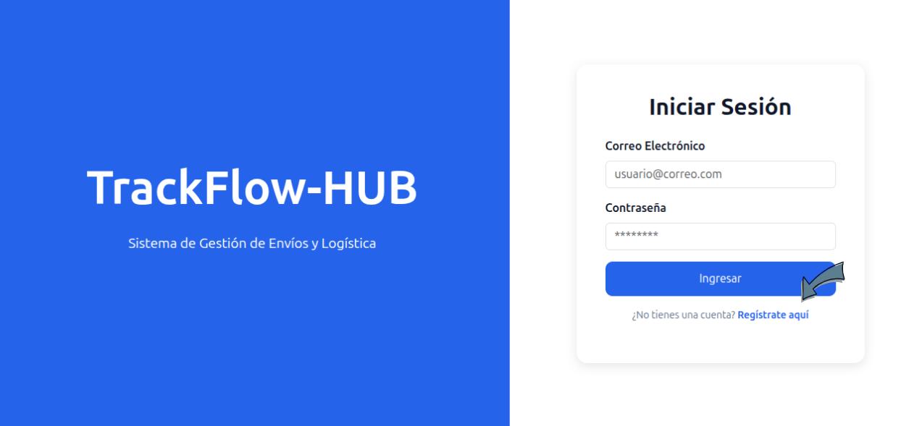
</p>

<p align="center">
  <b>Figura 1.</b> Pantalla de inicio de sesión.
</p>

<div align="justify">

El sistema mostrará el formulario de registro donde el usuario deberá ingresar la siguiente información según su tipo de cuenta:

**Para clientes:**
- Nombre y apellido.
- Teléfono (8 dígitos, solo números).
- Correo electrónico.
- Contraseña segura y confirmación de contraseña.
- Dirección de origen predeterminada (opcional).

**Para operadores logísticos:**
- Nombre y apellido.
- DPI/CUI.
- Teléfono y teléfono de respaldo.
- Correo electrónico.
- Fotografía de perfil.
- Zona de operación.
- Género.

**Para empresas de transporte:**
- Nombre de la empresa.
- Teléfono y teléfono de respaldo.
- Correo electrónico.
- NIT.
- Número de licencia operativa.

Todos los campos marcados con asterisco (*) son obligatorios. Si algún campo obligatorio no se completa, el sistema mostrará un mensaje de error indicando qué campo falta.

</div>

<p align="center">
  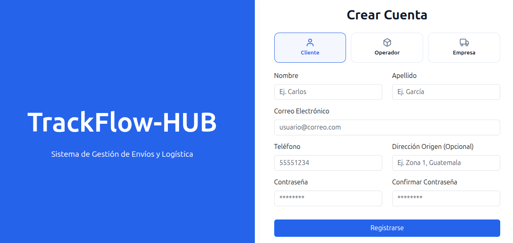
</p>

<p align="center">
  <b>Figura 2.</b> Formulario de registro de usuario.
</p>

<div align="justify">

Una vez completados todos los campos, el usuario debe presionar el botón **Registrarse**. El sistema enviará un correo electrónico de verificación. El usuario deberá revisar su bandeja de entrada y verificar su cuenta antes de poder iniciar sesión.

**Nota importante:** Los operadores logísticos y empresas de transporte deben esperar la aprobación del administrador antes de poder acceder al sistema.

</div>

---

<div align="center">

# Inicio de Sesión

</div>

<div align="justify">

Para acceder al sistema, el usuario debe ingresar sus credenciales en la pantalla de inicio de sesión:

- **Correo electrónico:** El correo con el que se registró.
- **Contraseña:** La contraseña que estableció durante el registro.

Después de ingresar los datos, debe presionar el botón **Iniciar Sesión**. El sistema redirigirá automáticamente al dashboard correspondiente según el tipo de usuario.

**Nota para administradores:** El sistema enviará un código de verificación de dos factores (2FA) al correo registrado. Deberá ingresar ese código para completar el inicio de sesión.

</div>

<p align="center">
  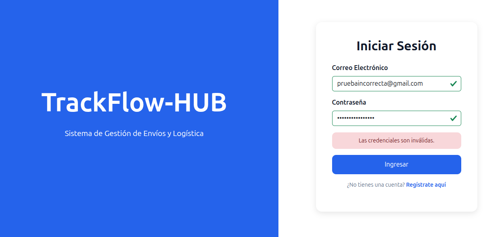
</p>

<p align="center">
  <b>Figura 3.</b> Pantalla de inicio de sesión con credenciales incorrectas.
</p>

---

<div align="center">

# MÓDULO DE ADMINISTRADOR

</div>

---

<div align="center">

# Dashboard del Administrador

</div>

<div align="justify">

Al iniciar sesión como administrador, el sistema mostrará el panel de administración. Este panel cuenta con una barra lateral izquierda con las siguientes secciones:

- **Operadores:** Gestión de solicitudes de registro de operadores logísticos.
- **Empresas:** Gestión de solicitudes de registro de empresas de transporte.
- **Administradores:** Registro de nuevos administradores.
- **Cambios de Perfil:** Aprobación de solicitudes de cambio de perfil de empresas y operadores.

En la parte superior del panel se muestran contadores con el resumen de solicitudes: por aprobar, aprobadas, rechazadas y total.

</div>

<p align="center">
  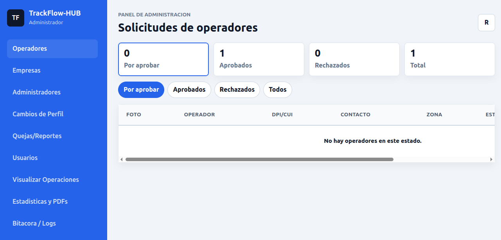
</p>

<p align="center">
  <b>Figura 4.</b> Dashboard principal del administrador.
</p>

---

<div align="center">

# Gestión de Solicitudes de Operadores

</div>

<div align="justify">

Para revisar las solicitudes de registro de operadores logísticos, hacer clic en **Operadores** en la barra lateral. El sistema mostrará una lista de todas las solicitudes con los siguientes filtros disponibles:

- **Por aprobar:** Muestra solicitudes pendientes de revisión.
- **Aprobados:** Muestra solicitudes que ya fueron aprobadas.
- **Rechazados:** Muestra solicitudes que fueron rechazadas.
- **Todos:** Muestra todas las solicitudes sin importar su estado.

Cada solicitud muestra la información del operador: nombre, apellido, DPI, teléfono, zona de operación, fotografía y correo electrónico.

## ¿Cómo aprobar una solicitud de operador?

Para aprobar la solicitud de un operador, el administrador debe hacer clic en el botón **Aprobar**. El sistema actualizará el estado de la solicitud a aprobado y enviará automáticamente un correo electrónico al operador con una contraseña temporal para que pueda iniciar sesión.

## ¿Cómo rechazar una solicitud de operador?

Para rechazar la solicitud, hacer clic en el botón **Rechazar**. El sistema mostrará un modal solicitando el motivo del rechazo. El administrador debe ingresar el motivo y presionar **Confirmar rechazo**. Se enviará un correo al operador con el motivo indicado.

</div>

<p align="center">
  
</p>

<p align="center">
  <b>Figura 5.</b> Gestión de solicitudes de operadores logísticos.
</p>

---

<div align="center">

# Gestión de Solicitudes de Empresas

</div>

<div align="justify">

Para revisar las solicitudes de registro de empresas de transporte, hacer clic en **Empresas** en la barra lateral. La interfaz es similar a la de operadores, con los mismos filtros disponibles.

Cada solicitud muestra la información de la empresa: nombre, NIT, número de licencia operativa, teléfono y correo.

## ¿Cómo agendar una reunión con una empresa?

Antes de aprobar a una empresa de transporte, el administrador puede agendar una reunión de verificación. Para hacerlo, hacer clic en el botón **Agendar Reunión**. El sistema mostrará un modal donde se debe ingresar:

- Fecha y hora de la reunión.
- Enlace de la reunión (por ejemplo: enlace de Google Meet).

Al guardar, se enviará automáticamente un correo a la empresa con los detalles de la reunión.

## ¿Cómo aprobar o rechazar una empresa?

El proceso es idéntico al de operadores. Al aprobar, la empresa recibirá acceso al sistema. Al rechazar, se solicitará un motivo que será enviado por correo.

</div>

<p align="center">
  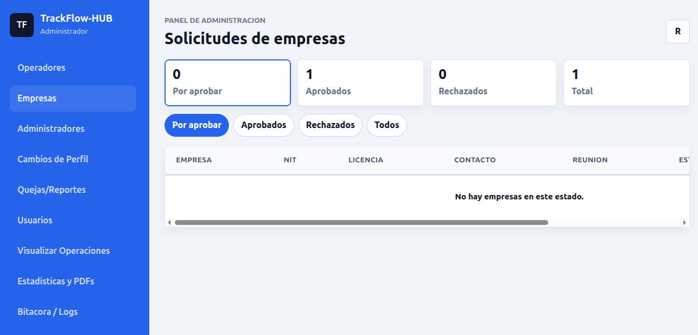
</p>

<p align="center">
  <b>Figura 6.</b> Gestión de solicitudes de empresas de transporte.
</p>

---

<div align="center">

# Gestión de Cambios de Perfil

</div>

<div align="justify">

Cuando una empresa o un operador solicita cambios en su perfil, el administrador debe aprobar o rechazar dichos cambios. Para acceder a esta sección, hacer clic en **Cambios de Perfil** en la barra lateral.

Cada solicitud muestra dos columnas:

- **Datos Actuales:** Información actual registrada en el sistema.
- **Cambios Solicitados:** Nueva información que el usuario desea actualizar.

Para aprobar los cambios, hacer clic en **Aprobar cambios**. El sistema actualizará automáticamente la información del perfil. Para rechazarlos, hacer clic en **Rechazar**, ingresar el motivo y confirmar. El usuario recibirá un correo con el resultado de su solicitud.

</div>

<p align="center">
  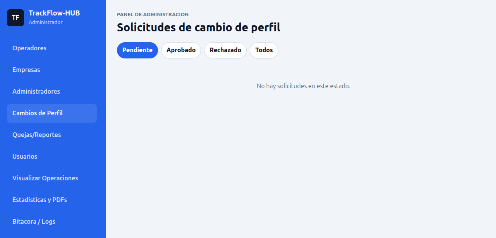
</p>

<p align="center">
  <b>Figura 7.</b> Gestión de solicitudes de cambio de perfil.
</p>

---

<div align="center">

# Registro de Nuevos Administradores

</div>

<div align="justify">

Para registrar un nuevo administrador en el sistema, hacer clic en **Administradores** en la barra lateral. El formulario solicita los siguientes datos:

- Nombre y apellido.
- Teléfono.
- Correo electrónico.
- Contraseña y confirmación de contraseña.

Al presionar **Crear Administrador**, el nuevo usuario tendrá acceso inmediato al panel de administración.

</div>

<p align="center">
  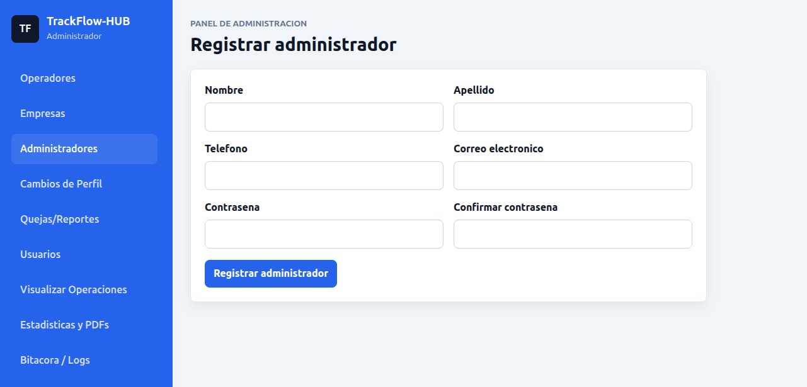
</p>

<p align="center">
  <b>Figura 8.</b> Formulario de registro de nuevo administrador.
</p>

---

<div align="center">

# MÓDULO DE EMPRESA DE TRANSPORTE

</div>

---

<div align="center">

# Dashboard de la Empresa

</div>

<div align="justify">

Al iniciar sesión como empresa de transporte, el sistema mostrará el portal empresarial. La barra de navegación superior contiene las siguientes secciones:

- **Inicio:** Resumen de ganancias, rutas activas y vehículos en flota.
- **Gestión de Rutas:** Administración de rutas de transporte.
- **Flota Vehículos:** Administración de los vehículos de la empresa.
- **Reportes Recibidos:** Reportes enviados por clientes sobre los servicios.
- **Gestión de Cupones:** Creación y envío de cupones de descuento.
- **Mi Perfil:** Información y solicitudes de cambio de perfil.

El inicio muestra tres indicadores clave: ganancias generadas, rutas activas y vehículos en flota.

</div>

<p align="center">
  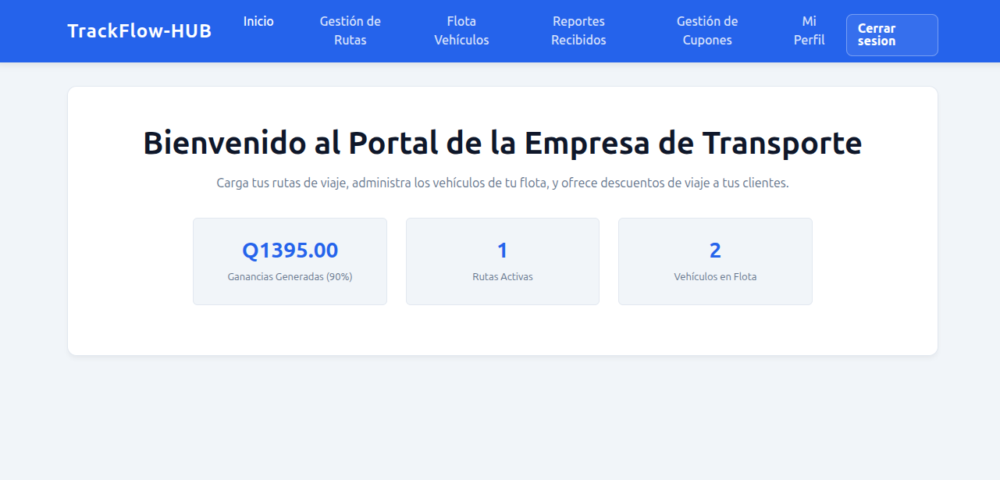
</p>

<p align="center">
  <b>Figura 9.</b> Dashboard principal de la empresa de transporte.
</p>

---

<div align="center">

# Gestión de Rutas

</div>

<div align="justify">

Para administrar las rutas de transporte, hacer clic en **Gestión de Rutas** en la barra de navegación. Esta sección se divide en dos columnas:

- **Columna izquierda:** Formularios para registrar rutas manualmente o cargar rutas masivas mediante CSV.
- **Columna derecha:** Listado de todas las rutas registradas con su estado actual.

## ¿Cómo registrar una ruta manualmente?

Para registrar una nueva ruta, completar el formulario con los siguientes datos:

- **Nombre de la Ruta:** Nombre descriptivo (por ejemplo: Capital - Xela).
- **Origen:** Ciudad o lugar de salida.
- **Destino:** Ciudad o lugar de llegada.
- **Precio Boleto:** Costo en Quetzales.
- **Tiempo Estimado:** Duración aproximada del viaje.

Presionar el botón **Registrar Ruta** para guardar. La ruta aparecerá inmediatamente en el listado y estará disponible para los clientes.

## ¿Cómo cargar rutas masivas con CSV?

Para cargar múltiples rutas a la vez, seleccionar un archivo CSV con el formato requerido y presionar **Cargar Archivo CSV**. El sistema procesará el archivo e insertará todas las rutas válidas.

## ¿Cómo editar una ruta?

En el listado de rutas, hacer clic en el botón **Editar** de la ruta que desea modificar. El formulario se llenará automáticamente con los datos actuales. Realizar los cambios necesarios y presionar **Guardar Cambios**.

## ¿Cómo suspender o cancelar una ruta?

Cada ruta tiene dos opciones adicionales:

- **Suspender temporalmente:** Oculta la ruta de la vista de los clientes sin eliminarla. Útil para mantenimientos o períodos de inactividad.
- **Cancelar por emergencia:** Cancela la ruta definitivamente. Al hacer clic, el sistema solicitará ingresar el motivo de la cancelación. Una vez confirmada, se enviará automáticamente un correo electrónico a todos los clientes que tengan reservaciones activas en esa ruta notificándoles la cancelación.

</div>

<p align="center">
  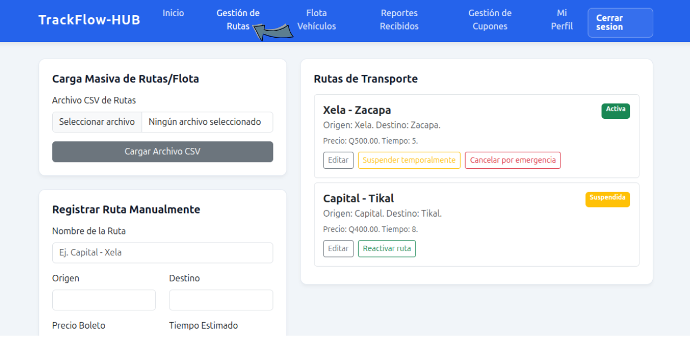
</p>

<p align="center">
  <b>Figura 10.</b> Gestión de rutas de transporte.
</p>

---

<div align="center">

# Flota de Vehículos

</div>

<div align="justify">

Para administrar los vehículos de la empresa, hacer clic en **Flota Vehículos** en la barra de navegación.

## ¿Cómo registrar un vehículo?

Completar el formulario con los siguientes datos:

- **Tipo de Vehículo:** Categoría del vehículo (por ejemplo: Microbús, Autobús, Camión).
- **Placa:** Número de placa del vehículo.
- **Capacidad de Pasajeros:** Número máximo de pasajeros.
- **Modelo:** Marca y modelo del vehículo.
- **Año:** Año de fabricación.

Presionar **Registrar Vehículo** para guardar. También es posible cargar múltiples vehículos a la vez usando un archivo CSV con el botón **Cargar CSV de Flota**.

## ¿Cómo cambiar el estado de un vehículo?

Cada vehículo registrado muestra botones para cambiar su estado entre:

- **Disponible:** El vehículo está listo para operar.
- **En Ruta:** El vehículo está actualmente en servicio.
- **Mantenimiento:** El vehículo está en reparación o mantenimiento.
- **Fuera de Servicio:** El vehículo no está disponible para operar.

Para cambiar el estado, hacer clic en el botón del estado deseado. Para eliminar un vehículo de la flota, hacer clic en el botón **Eliminar**.

</div>

<p align="center">
  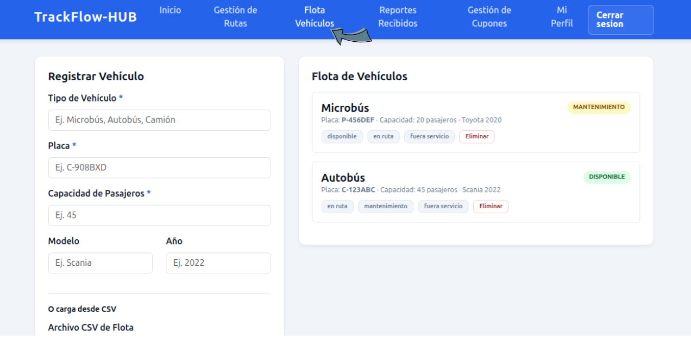
</p>

<p align="center">
  <b>Figura 11.</b> Gestión de flota de vehículos.
</p>

---

<div align="center">

# Reportes de la Empresa

</div>

<div align="justify">

La sección de reportes permite a la empresa consultar información detallada sobre su desempeño. Para acceder, hacer clic en **Reportes Recibidos** en la barra de navegación. Esta sección tiene cinco pestañas:

**Reportes de Clientes:** Muestra los reportes enviados por clientes sobre los servicios de la empresa, incluyendo el motivo, descripción y estado del reporte.

**Ganancias:** Muestra un resumen de las ganancias generadas por ruta, incluyendo:
- Total de reservaciones.
- Ingresos totales.
- Ganancias de la empresa (90% del total).
- Comisión de la plataforma (10% del total).

**Historial de Servicios:** Muestra todas las reservaciones contratadas por clientes en las rutas de la empresa, con el estado y monto de cada una.

**Calificaciones:** Muestra las reseñas y puntuaciones dejadas por los clientes, junto con el promedio general de calificación de la empresa.

**Estado de Rutas:** Muestra un resumen de todas las rutas de la empresa con su estado actual, cantidad de reservaciones y calificación promedio.

</div>

<p align="center">
  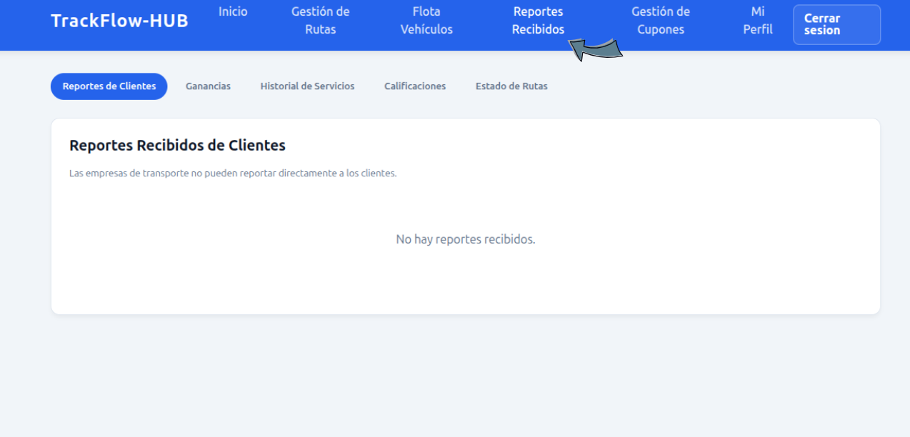
</p>

<p align="center">
  <b>Figura 12.</b> Sección de reportes de la empresa.
</p>

---

<div align="center">

# Gestión de Cupones

</div>

<div align="justify">

Para gestionar los cupones de descuento, hacer clic en **Gestión de Cupones** en la barra de navegación. Esta sección se divide en dos columnas:

- **Columna izquierda:** Formulario para crear nuevos cupones.
- **Columna derecha:** Listado de cupones creados.

## ¿Cómo crear un cupón?

Completar el formulario con los siguientes datos:

- **Código:** Código único del cupón (se convierte automáticamente a mayúsculas).
- **Descripción:** Descripción del descuento ofrecido.
- **Tipo de Descuento:** Seleccionar entre porcentaje (%) o monto fijo (Q).
- **Valor:** Cantidad del descuento según el tipo seleccionado.
- **Fecha Inicio y Fecha Fin:** Período de vigencia del cupón.
- **Usos Máximos:** Número máximo de veces que puede ser utilizado. Dejar vacío para usos ilimitados.

Presionar **Crear Cupón** para guardar.

## ¿Cómo enviar un cupón a un cliente?

En el listado de cupones activos, cada cupón tiene un campo de texto donde se puede ingresar el correo electrónico del cliente al que se desea enviar el cupón. Ingresar el correo y presionar **Enviar**. El sistema enviará automáticamente un correo al cliente con el código del cupón y sus condiciones.

## ¿Cómo desactivar un cupón?

Para desactivar un cupón activo, hacer clic en el botón **Desactivar** que aparece en la tarjeta del cupón. El estado del cupón cambiará a expirado y ya no podrá ser utilizado por los clientes.

</div>

<p align="center">
  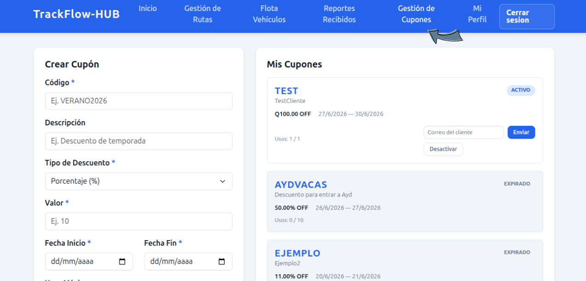
</p>

<p align="center">
  <b>Figura 13.</b> Gestión de cupones de descuento.
</p>

---

<div align="center">

# Perfil de la Empresa

</div>

<div align="justify">

Para ver y solicitar cambios en el perfil, hacer clic en **Mi Perfil** en la barra de navegación.

La pantalla muestra dos secciones:

**Columna izquierda - Información actual:** Muestra los datos actuales de la empresa incluyendo email, NIT y número de licencia operativa. Estos campos no pueden modificarse directamente.

**Columna derecha - Solicitar cambios:** Permite solicitar cambios en los siguientes campos:
- Nombre de la empresa.
- Teléfono principal.
- Teléfono de respaldo.

Para solicitar un cambio, modificar los campos deseados y presionar **Solicitar Cambios**. La solicitud quedará en estado pendiente hasta que el administrador la apruebe o rechace.

En la parte derecha de la pantalla se muestra el **Historial de Solicitudes** con todas las solicitudes enviadas y su estado actual (pendiente, aceptado o rechazado). Si una solicitud fue rechazada, se mostrará el motivo indicado por el administrador.

</div>

<p align="center">
  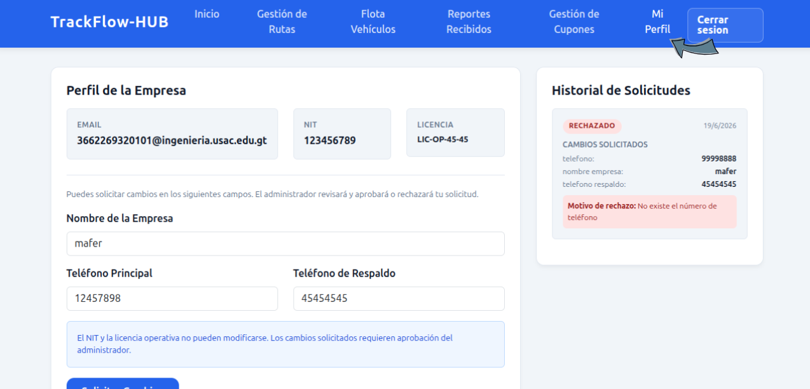
</p>

<p align="center">
  <b>Figura 14.</b> Perfil de la empresa de transporte.
</p>

---

<div align="center">

# MÓDULO DE OPERADOR LOGÍSTICO

</div>

---

<div align="center">

# Dashboard del Operador

</div>

<div align="justify">

Al iniciar sesión como operador logístico, el sistema mostrará el portal del operador. La barra de navegación contiene las siguientes secciones:

- **Inicio:** Resumen de servicios activos y ganancias.
- **Mis Servicios:** Gestión de servicios de envío ofrecidos.
- **Calendario:** Vista de reservaciones en formato calendario.
- **Calificaciones:** Reseñas recibidas de clientes.
- **Cupones:** Gestión de cupones de descuento.
- **Reportes:** Reportes recibidos y enviados.
- **Mi Perfil:** Información personal del operador.

</div>

<p align="center">
  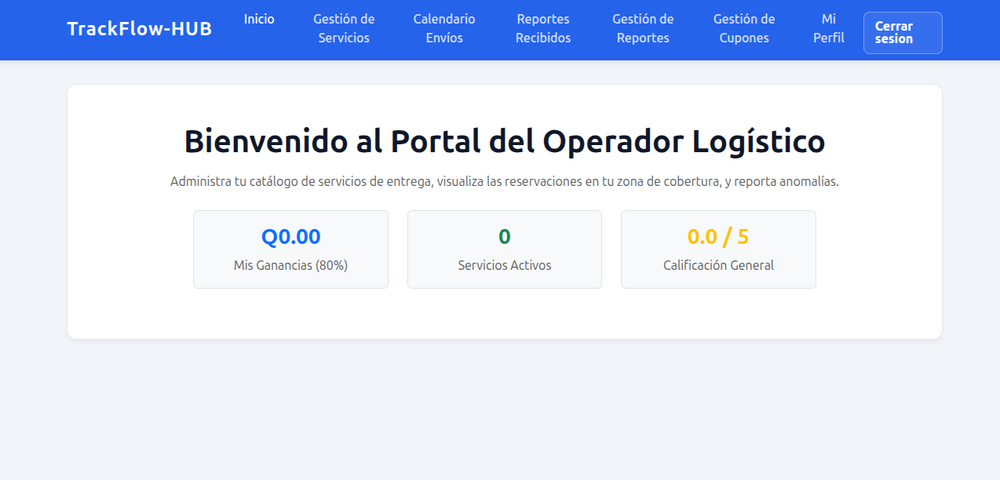
</p>

<p align="center">
  <b>Figura 15.</b> Dashboard principal del operador logístico.
</p>

---

<div align="center">

# Gestión de Servicios de Envío

</div>

<div align="justify">

Para administrar los servicios de envío, hacer clic en **Mis Servicios** en la barra de navegación.

## ¿Cómo registrar un servicio?

Para registrar un nuevo servicio de envío, completar el formulario con los siguientes datos mínimos:

- **Zona de cobertura:** Área geográfica donde opera el servicio.
- **Capacidad de carga (kg):** Peso máximo que puede transportar.
- **Precio por envío:** Costo en Quetzales.
- **Fotografías:** Mínimo 3 fotografías del vehículo o bodega.

Presionar **Registrar Servicio** para guardar. El servicio quedará visible para los clientes inmediatamente.

## ¿Cómo editar o suspender un servicio?

Cada servicio registrado tiene las opciones de:

- **Editar:** Modifica los datos del servicio.
- **Suspender temporalmente:** Oculta el servicio de la vista de los clientes sin eliminarlo. Útil durante períodos de mantenimiento o inactividad.
- **Eliminar:** Elimina el servicio definitivamente del sistema.

</div>

<p align="center">
  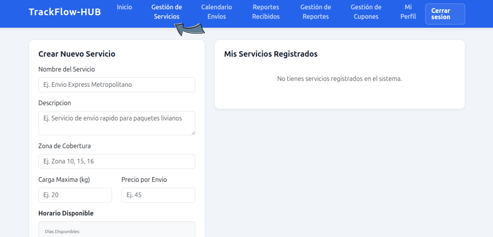
</p>

<p align="center">
  <b>Figura 16.</b> Gestión de servicios de envío del operador.
</p>

---

<div align="center">

# Vista de Calendario

</div>

<div align="justify">

El calendario permite al operador visualizar todas las fechas en que los clientes tienen reservaciones activas. Para acceder, hacer clic en **Calendario** en la barra de navegación.

El calendario muestra un mes completo con los días marcados donde existen reservaciones. Al hacer clic en un día específico, se mostrarán los detalles de las reservaciones programadas para esa fecha, incluyendo el nombre del cliente y el servicio contratado.

Esta vista ayuda al operador a organizar su agenda y planificar sus operaciones de manera eficiente.

</div>

<p align="center">
  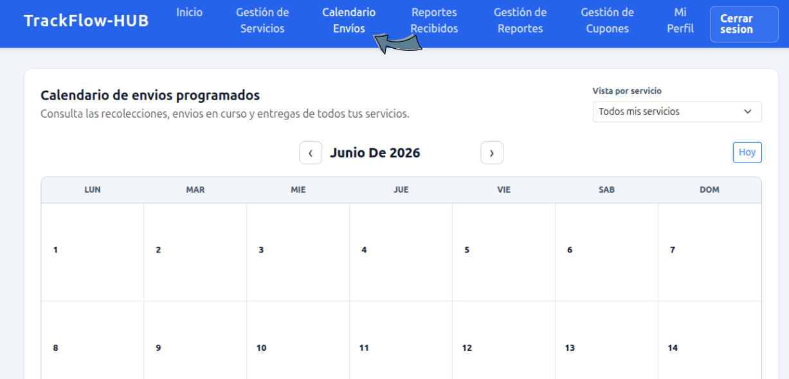
</p>

<p align="center">
  <b>Figura 17.</b> Vista de calendario de reservaciones.
</p>

---

---

<div align="center">

# Mi Perfil del Operador

</div>

<div align="justify">

Para ver y solicitar cambios en el perfil, hacer clic en **Mi Perfil** en la barra de navegación.

La pantalla muestra dos secciones:

**Información actual:** Muestra los datos actuales del operador incluyendo nombre, apellido, DPI, teléfono, zona de operación y correo electrónico.

**Solicitar cambios:** Permite solicitar modificaciones en los campos editables. Los cambios solicitados requieren aprobación del administrador antes de hacerse efectivos.

Para solicitar un cambio, modificar los campos deseados y presionar **Solicitar Cambios**. La solicitud quedará en estado pendiente hasta que el administrador la apruebe o rechace.

En el historial de solicitudes se pueden ver todas las solicitudes enviadas con su estado actual (pendiente, aceptado o rechazado). Si una solicitud fue rechazada, se mostrará el motivo indicado por el administrador.

</div>

<p align="center">
  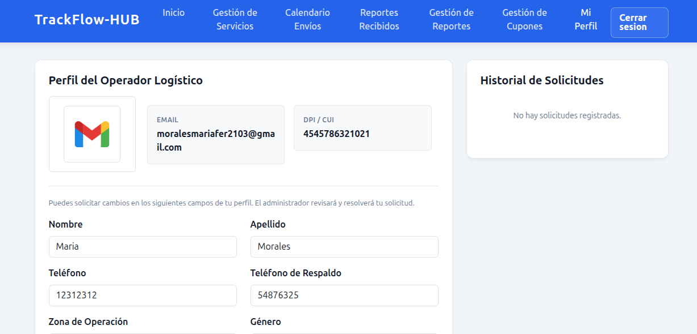
</p>

<p align="center">
  <b>Figura 18.</b> Perfil del operador logístico.
</p>
---

<div align="center">

# MÓDULO DE CLIENTE

</div>

---

<div align="center">

# Dashboard Principal del Cliente

</div>

<div align="justify">

Al iniciar sesión como cliente, el sistema mostrará el Dashboard principal. La barra de navegación superior contiene los accesos directos a todas las secciones del sistema con íconos descriptivos:

- **Inicio:** Pantalla principal con resumen de actividad.
- **Transporte:** Explorar y reservar rutas de transporte.
- **Carrito:** Servicios agregados pendientes de pago.
- **Historial:** Todas las reservaciones realizadas.
- **Métodos de Pago:** Gestión de tarjetas y wallets.
- **Cupones:** Cupones de descuento disponibles.
- **Mi Perfil:** Ver y editar información personal.
- **Ayuda:** Centro de ayuda y preguntas frecuentes.
- **Cerrar Sesión:** Finaliza la sesión actual.

El inicio muestra tres indicadores: servicios en carrito, reservaciones activas y métodos de pago registrados.

</div>

<p align="center">
  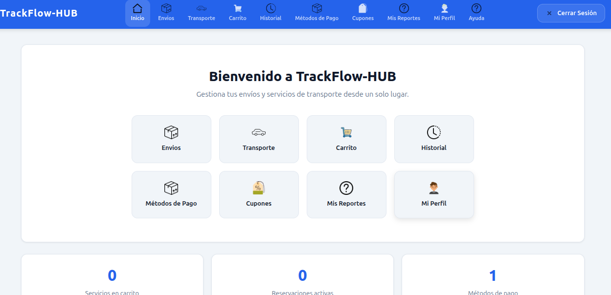
</p>

<p align="center">
  <b>Figura 19.</b> Dashboard principal del cliente.
</p>

---

<div align="center">

# Módulo de Transporte

</div>

<div align="justify">

El módulo de transporte permite al cliente explorar todas las rutas disponibles y realizar reservaciones. Para acceder, hacer clic en **Transporte** en la barra de navegación.

Cada tarjeta de ruta muestra: nombre de la ruta, origen, destino, tiempo estimado y precio.

## ¿Cómo reservar una ruta?

1. Identificar la ruta deseada en el listado.
2. En el campo **Fecha de viaje**, seleccionar la fecha. Debe ser con al menos 24 horas de anticipación.
3. Presionar **Agregar al Carrito**.

Si la fecha no se selecciona, el sistema mostrará una alerta de advertencia. Si el servicio se agrega correctamente, aparecerá una alerta verde de confirmación.

</div>

<p align="center">
  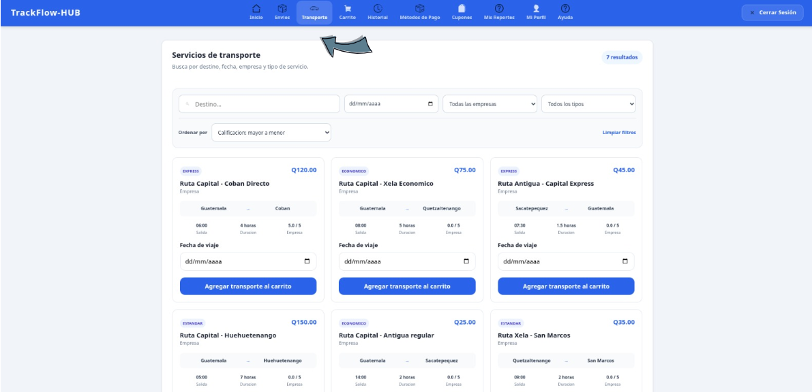
</p>

<p align="center">
  <b>Figura 20.</b> Listado de rutas de transporte disponibles.
</p>

<p align="center">
  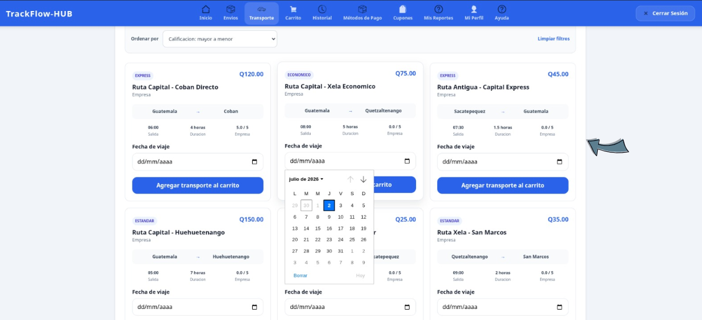
</p>

<p align="center">
  <b>Figura 21.</b> Selección de fecha y agregado al carrito.
</p>

---

<div align="center">

# Carrito de Compras

</div>

<div align="justify">

El carrito acumula todos los servicios que el cliente desea contratar antes del pago. Para acceder, hacer clic en **Carrito**.

## ¿Cómo eliminar un servicio del carrito?

Hacer clic en **Eliminar** junto al servicio. El sistema mostrará un modal de confirmación. Si confirma, el servicio será eliminado. Para vaciar todo el carrito, usar el botón **Vaciar carrito**.

## ¿Cómo aplicar un cupón?

1. Localizar el campo **Cupón de descuento**.
2. Ingresar el código del cupón.
3. Presionar **Aplicar**.

Si el cupón es válido, el total se actualizará con el descuento aplicado. El precio original aparecerá tachado.

## ¿Cómo realizar el pago?

1. Verificar los servicios en el carrito.
2. Seleccionar el método de pago.
3. Presionar **Confirmar Pago**.
4. Confirmar en el modal que aparece.

Si el pago es exitoso, el carrito quedará vacío y la reservación aparecerá en el historial como **Confirmado**.

</div>

<p align="center">
  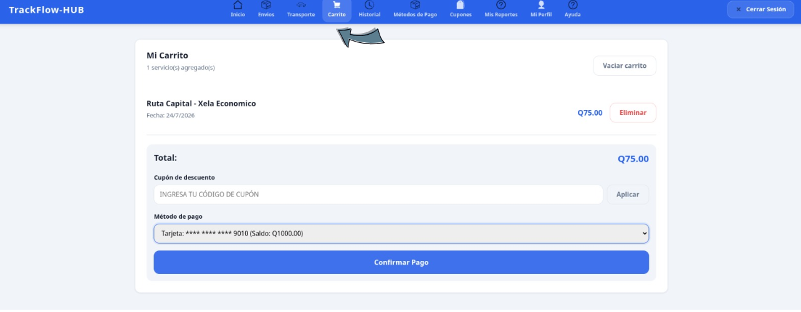
</p>

<p align="center">
  <b>Figura 22.</b> Carrito con servicios y cupón aplicado.
</p>

<p align="center">
  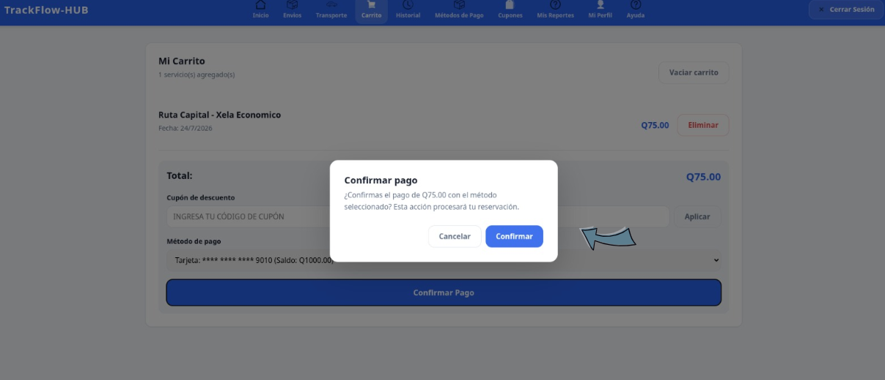
</p>

<p align="center">
  <b>Figura 23.</b> Modal de confirmación de pago.
</p>

---

<div align="center">

# Historial de Reservaciones

</div>

<div align="justify">

El historial permite consultar todos los servicios contratados con su estado actual. Para acceder, hacer clic en **Historial**.

Los estados posibles son:
- **Confirmado** (verde): Reservación activa.
- **En Tránsito** (azul): Servicio en ejecución.
- **Entregado** (verde claro): Servicio completado.
- **Cancelado** (rojo): Reservación cancelada.
- **Pendiente** (amarillo): Pendiente de confirmación.

## ¿Cómo cancelar una reservación?

Solo se puede cancelar si faltan más de 24 horas para la fecha del servicio:

1. Identificar la reservación con estado **Confirmado**.
2. Hacer clic en **Cancelar**.
3. Confirmar en el modal que aparece.

El saldo será reembolsado automáticamente al método de pago utilizado. Si faltan menos de 24 horas, el sistema mostrará un error indicando que no es posible cancelar.

</div>

<p align="center">
  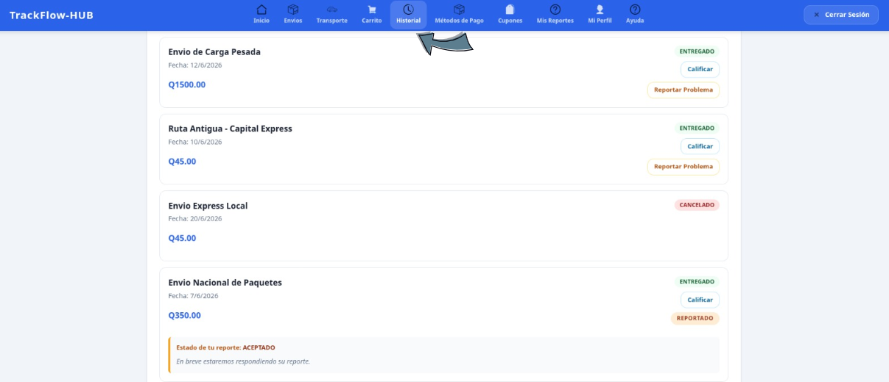
</p>

<p align="center">
  <b>Figura 24.</b> Historial de reservaciones del cliente.
</p>

<p align="center">
  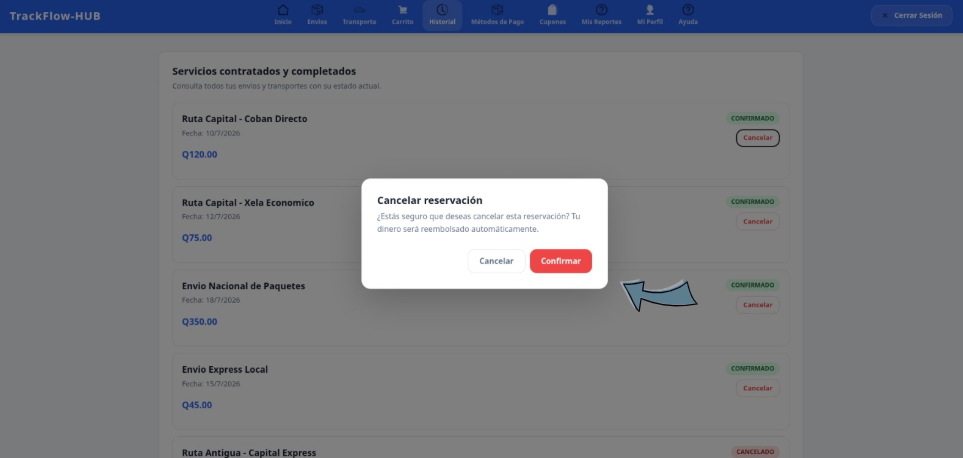
</p>

<p align="center">
  <b>Figura 25.</b> Modal de confirmación de cancelación.
</p>

---

<div align="center">

# Métodos de Pago

</div>

<div align="justify">

En esta sección el cliente gestiona sus métodos de pago. Para acceder, hacer clic en **Métodos de Pago**.

## ¿Cómo agregar una tarjeta?

Completar el formulario con:
- **Número de Tarjeta:** De 13 a 19 dígitos. El sistema valida el número con el algoritmo de Luhn.
- **Nombre en la Tarjeta:** Nombre del titular.
- **Vencimiento:** Formato MM/YYYY.
- **CVV:** 3 o 4 dígitos.

Al registrar una tarjeta, el sistema asigna automáticamente un saldo inicial de **Q1,000.00**.

**Número de tarjeta de prueba:** `4532015112830366`

## ¿Cómo agregar una Wallet?

Ingresar el ID de la billetera virtual (por ejemplo: usuario@wallet) y presionar **Vincular Wallet**. También se asignará un saldo de Q1,000.00.

</div>

<p align="center">
  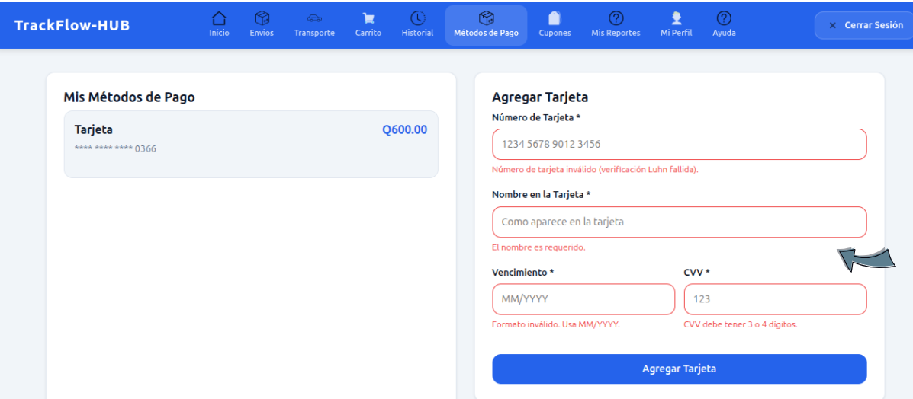
</p>

<p align="center">
  <b>Figura 26.</b> Formulario para agregar tarjeta de pago.
</p>

<p align="center">
  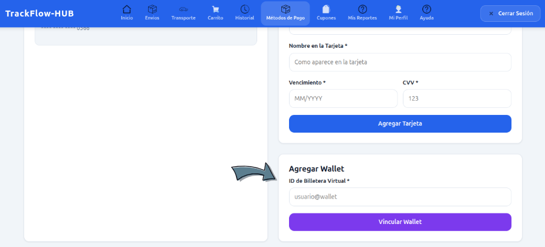
</p>

<p align="center">
  <b>Figura 27.</b> Formulario para agregar wallet.
</p>

---

<div align="center">

# Cupones de Descuento

</div>

<div align="justify">

En esta sección el cliente visualiza los cupones enviados por operadores y empresas de transporte. Para acceder, hacer clic en **Cupones**.

Cada cupón muestra: código, descripción, descuento, fechas de vigencia, monto mínimo si aplica, y estado (activo o canjeado).

Si el cupón está activo, aparecerá el botón **Copiar código** para copiar el código al portapapeles y usarlo en el carrito de compras.

</div>

<p align="center">
  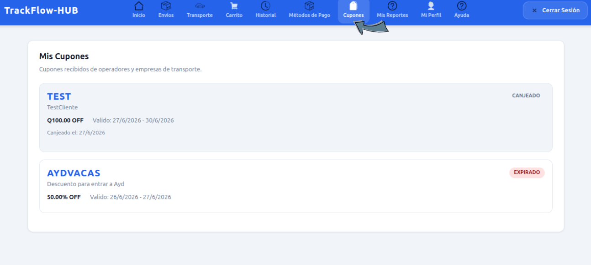
</p>

<p align="center">
  <b>Figura 28.</b> Sección de cupones de descuento del cliente.
</p>

---

<div align="center">

# Mi Perfil

</div>

<div align="justify">

Para ver y editar la información personal, hacer clic en **Mi Perfil**.

La pantalla se divide en dos columnas:
- **Columna izquierda:** Muestra la foto de perfil, nombre, correo, teléfono y dirección actuales.
- **Columna derecha:** Formulario para editar nombre, apellido, teléfono y dirección de origen.

Para guardar los cambios, presionar **Guardar Cambios**. El sistema mostrará un modal de confirmación antes de aplicar los cambios.

**Nota:** El correo electrónico no puede modificarse desde esta sección.

</div>

<p align="center">
  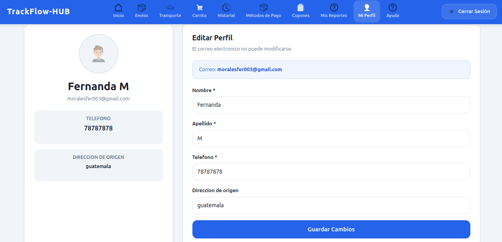
</p>

<p align="center">
  <b>Figura 29.</b> Sección de perfil del cliente.
</p>

<p align="center">
  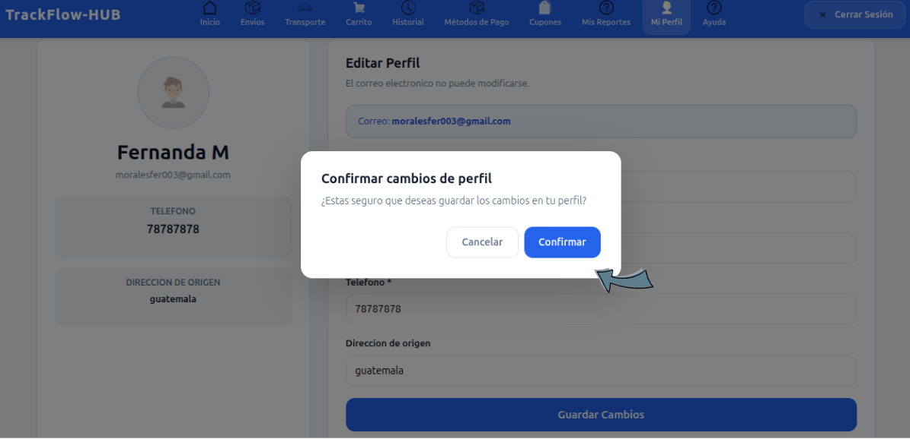
</p>

<p align="center">
  <b>Figura 30.</b> Modal de confirmación al editar perfil.
</p>

---

<div align="center">

# Centro de Ayuda

</div>

<div align="justify">

El centro de ayuda contiene respuestas a las preguntas más frecuentes. Para acceder, hacer clic en **Ayuda**.

Las preguntas se presentan en formato acordeón. Hacer clic en una pregunta para ver su respuesta. Las preguntas disponibles son:

- ¿Cómo agrego un servicio al carrito?
- ¿Cómo pago mis reservaciones?
- ¿Puedo cancelar una reservación?
- ¿Cómo agrego una tarjeta de crédito?
- ¿Qué es una Wallet?
- ¿Cómo uso un cupón de descuento?

Si no encuentra respuesta, puede contactar al equipo de soporte presionando **Enviar correo de soporte**, que abrirá Gmail con un correo prellenado.

</div>

<p align="center">
  
</p>

<p align="center">
  <b>Figura 31.</b> Centro de ayuda con preguntas frecuentes.
</p>

---

<div align="center">

# Cerrar Sesión

</div>

<div align="justify">

Para finalizar la sesión de forma segura, presionar el botón **Cerrar Sesión** ubicado en el extremo derecho de la barra de navegación superior. El sistema eliminará la información de autenticación y redirigirá a la pantalla de inicio de sesión.

Se recomienda siempre cerrar sesión al terminar de usar la plataforma, especialmente en computadoras compartidas o públicas.

</div>

<p align="center">
  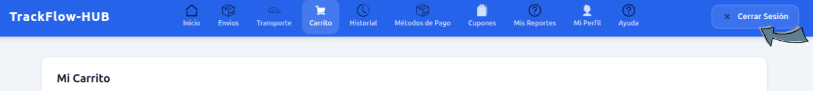
</p>

<p align="center">
  <b>Figura 32.</b> Botón de cerrar sesión.
</p>

---

<div align="center">

# Mensajes del Sistema

</div>

<div align="justify">

TrackFlow-HUB utiliza alertas visuales para comunicar el resultado de cada acción. Las alertas aparecen en la esquina superior derecha y desaparecen automáticamente.

Los tipos de alertas son:

- **Alerta verde (Éxito):** Acción realizada correctamente.
- **Alerta roja (Error):** Ocurrió un problema.
- **Alerta amarilla (Advertencia):** Falta completar algún dato.
- **Alerta azul (Información):** Información adicional relevante.

Para acciones importantes como eliminar, vaciar el carrito, confirmar pagos o cancelar reservaciones, el sistema mostrará un **modal de confirmación** con dos botones:

- **Cancelar:** Cierra el modal sin cambios.
- **Confirmar:** Procede con la acción.

Mientras el sistema procesa una solicitud, se mostrará un **indicador de carga** (spinner) en el centro de la pantalla. Durante este tiempo los botones estarán deshabilitados para evitar acciones duplicadas.

</div>

---

<div align="center">

# Conclusión

</div>

<div align="justify">

TrackFlow-HUB proporciona una plataforma centralizada y fácil de usar para la gestión de servicios de transporte y envíos. Cada módulo está diseñado pensando en la experiencia del usuario, con interfaces intuitivas, íconos descriptivos, alertas claras y confirmaciones antes de acciones importantes.

Con este manual, todos los tipos de usuarios cuentan con la información necesaria para aprovechar al máximo las funcionalidades disponibles en la plataforma: desde la administración y aprobación de usuarios, hasta la gestión de rutas, servicios de envío, cupones de descuento y reservaciones.

Para cualquier duda adicional, los clientes pueden consultar el Centro de Ayuda dentro de la plataforma o contactar al equipo de soporte a través del correo electrónico disponible en dicha sección.

</div>